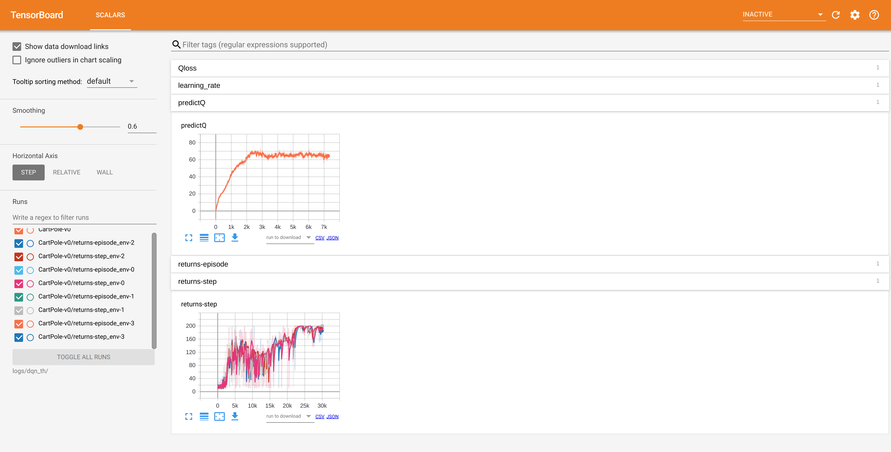

# XuanPolicy: A Comprehensive and Unified Deep Reinforcement Learning Library #

[](https://pypi.org/project/xuanpolicy/)
[](https://pytorch.org/get-started/locally/)
[](https://www.tensorflow.org/install)
[](https://www.mindspore.cn/install/en)
[](https://www.anaconda.com/download)

[](https://www.gymlibrary.dev/)
[](https://www.gymlibrary.dev/)
[](https://pettingzoo.farama.org/)

[](https://github.com/wenzhangliu/XuanPolicy/blob/master/LICENSE.txt)


[//]: # ([![Conda]&#40;https://img.shields.io/conda/vn/conda-forge/tianshou&#41;]&#40;https://github.com/conda-forge/tianshou-feedstock&#41;)

[//]: # ([![Read the Docs]&#40;https://img.shields.io/readthedocs/tianshou&#41;]&#40;https://tianshou.readthedocs.io/en/master&#41;)

[//]: # ([![Read the Docs]&#40;https://img.shields.io/readthedocs/tianshou-docs-zh-cn?label=%E4%B8%AD%E6%96%87%E6%96%87%E6%A1%A3&#41;]&#40;https://tianshou.readthedocs.io/zh/master/&#41;)

[//]: # ([![Unittest]&#40;https://github.com/thu-ml/tianshou/workflows/Unittest/badge.svg?branch=master&#41;]&#40;https://github.com/thu-ml/tianshou/actions&#41;)

[//]: # ([![codecov]&#40;https://img.shields.io/codecov/c/gh/thu-ml/tianshou&#41;]&#40;https://codecov.io/gh/thu-ml/tianshou&#41;)

[//]: # ([![GitHub issues]&#40;https://img.shields.io/github/issues/thu-ml/tianshou&#41;]&#40;https://github.com/thu-ml/tianshou/issues&#41;)

[//]: # ([![GitHub stars]&#40;https://img.shields.io/github/stars/thu-ml/tianshou&#41;]&#40;https://github.com/thu-ml/tianshou/stargazers&#41;)

[//]: # ([![GitHub forks]&#40;https://img.shields.io/github/forks/thu-ml/tianshou&#41;]&#40;https://github.com/thu-ml/tianshou/network&#41;)

[//]: # ([![GitHub license]&#40;https://img.shields.io/github/license/thu-ml/tianshou&#41;]&#40;https://github.com/thu-ml/tianshou/blob/master/LICENSE&#41;)

**XuanPolicy** is an open-source ensemble of Deep Reinforcement Learning (DRL) algorithm implementations.

We call it as Xuan-Ce (玄策) in Chinese. 
"Xuan (玄)" means incredible and magic box, "Ce (策)" means policy.

DRL algorithms are sensitive to hyper-parameters tuning, varying in performance with different tricks, 
and suffering from unstable training processes, therefore, sometimes DRL algorithms seems elusive and "Xuan". 
This project gives a thorough, high-quality and easy-to-understand implementation of DRL algorithms, 
and hope this implementation can give a hint on the magics of reinforcement learning.

We expect it to be compatible with multiple deep learning toolboxes (torch, tensorflow, and mindspore),
and hope it can really become a zoo full of DRL algorithms. 

This project is supported by Peng Cheng Laboratory.

## Currently Supported Agents

### DRL
- Vanilla Policy Gradient - PG [[Paper](https://proceedings.neurips.cc/paper/2001/file/4b86abe48d358ecf194c56c69108433e-Paper.pdf)]
- Phasic Policy Gradient - PPG [[Paper](http://proceedings.mlr.press/v139/cobbe21a/cobbe21a.pdf)] [[Code](https://github.com/openai/phasic-policy-gradient)]
- Advantage Actor Critic - A2C [[Paper](http://proceedings.mlr.press/v48/mniha16.pdf)] [[Code](https://github.com/openai/baselines/tree/master/baselines/a2c)]
- Soft actor-critic based on maximum entropy - SAC [[Paper](http://proceedings.mlr.press/v80/haarnoja18b/haarnoja18b.pdf)] [[Code](http://github.com/haarnoja/sac)]
- Soft actor-critic for discrete actions - SAC-Discrete [[Paper](https://arxiv.org/pdf/1910.07207.pdf)] [[Code](https://github.com/p-christ/Deep-Reinforcement-Learning-Algorithms-with-PyTorch)]
- Proximal Policy Optimization with clipped objective - PPO-Clip [[Paper](https://arxiv.org/pdf/1707.06347.pdf)] [[Code]( https://github.com/berkeleydeeprlcourse/homework/tree/master/hw4)]
- Proximal Policy Optimization with KL divergence - PPO-KL [[Paper](https://arxiv.org/pdf/1707.06347.pdf)] [[Code]( https://github.com/berkeleydeeprlcourse/homework/tree/master/hw4)]
- Deep Q Network - DQN [[Paper](https://www.nature.com/articles/nature14236)]
- DQN with Double Q-learning - Double DQN [[Paper](https://ojs.aaai.org/index.php/AAAI/article/view/10295)]
- DQN with Dueling network - Dueling DQN [[Paper](http://proceedings.mlr.press/v48/wangf16.pdf)]
- DQN with Prioritized Experience Replay - PER [[Paper](https://arxiv.org/pdf/1511.05952.pdf)]
- DQN with Parameter Space Noise for Exploration - NoisyNet [[Paper](https://arxiv.org/pdf/1706.01905.pdf)]
- DQN with Convolutional Neural Network - C-DQN [[Paper](https://ieeexplore.ieee.org/abstract/document/9867958/)]
- DQN with Long Short-term Memory - L-DQN [[Paper](https://link.springer.com/article/10.1007/s10489-022-04317-2)]
- DQN with CNN and Long Short-term Memory - CL-DQN [[Paper](https://link.springer.com/article/10.1007/s10489-022-04317-2)]
- DQN with Quantile Regression - QRDQN [[Paper](https://ojs.aaai.org/index.php/AAAI/article/view/11791)]
- Distributional Reinforcement Learning - C51 [[Paper](http://proceedings.mlr.press/v70/bellemare17a/bellemare17a.pdf)]
- Deep Deterministic Policy Gradient - DDPG [[Paper](https://arxiv.org/pdf/1509.02971.pdf)] [[Code](https://github.com/openai/baselines/tree/master/baselines/ddpg)]
- Twin Delayed Deep Deterministic Policy Gradient - TD3 [[Paper](http://proceedings.mlr.press/v80/fujimoto18a/fujimoto18a.pdf)][[Code](https://github.com/sfujim/TD3)]
- Parameterised deep Q network - P-DQN [[Paper](https://arxiv.org/pdf/1810.06394.pdf)]
- Multi-pass parameterised deep Q network - MP-DQN [[Paper](https://arxiv.org/pdf/1905.04388.pdf)] [[Code](https://github.com/cycraig/MP-DQN)]
- Split parameterised deep Q network - SP-DQN [[Paper](https://arxiv.org/pdf/1810.06394.pdf)]

### MARL
- Independent Q-learning - IQL [[Paper](https://hal.science/file/index/docid/720669/filename/Matignon2012independent.pdf)] [[Code](https://github.com/oxwhirl/pymarl)]
- Value Decomposition Networks - VDN [[Paper](https://arxiv.org/pdf/1706.05296.pdf)] [[Code](https://github.com/oxwhirl/pymarl)]
- Q-mixing networks - QMIX [[Paper](http://proceedings.mlr.press/v80/rashid18a/rashid18a.pdf)] [[Code](https://github.com/oxwhirl/pymarl)]
- Weighted Q-mixing networks - WQMIX [[Paper](https://proceedings.neurips.cc/paper/2020/file/73a427badebe0e32caa2e1fc7530b7f3-Paper.pdf)] [[Code](https://github.com/oxwhirl/wqmix)]
- Q-transformation - QTRAN [[Paper](http://proceedings.mlr.press/v97/son19a/son19a.pdf)] [[Code](https://github.com/Sonkyunghwan/QTRAN)]
- Deep Coordination Graphs - DCG [[Paper](http://proceedings.mlr.press/v119/boehmer20a/boehmer20a.pdf)] [[Code](https://github.com/wendelinboehmer/dcg)]
- Independent Deep Deterministic Policy Gradient - IDDPG [[Paper](https://proceedings.neurips.cc/paper/2017/file/68a9750337a418a86fe06c1991a1d64c-Paper.pdf)]
- Multi-agent Deep Deterministic Policy Gradient - MADDPG [[Paper](https://proceedings.neurips.cc/paper/2017/file/68a9750337a418a86fe06c1991a1d64c-Paper.pdf)] [[Code](https://github.com/openai/maddpg)]
- Counterfactual Multi-agent Policy Gradient - COMA [[Paper](https://ojs.aaai.org/index.php/AAAI/article/view/11794)] [[Code](https://github.com/oxwhirl/pymarl)]
- Multi-agent Proximal Policy Optimization - MAPPO [[Paper](https://proceedings.neurips.cc/paper_files/paper/2022/file/9c1535a02f0ce079433344e14d910597-Paper-Datasets_and_Benchmarks.pdf)] [[Code](https://github.com/marlbenchmark/on-policy)]
- Mean-Field Q-learning - MFQ [[Paper](http://proceedings.mlr.press/v80/yang18d/yang18d.pdf)] [[Code](https://github.com/mlii/mfrl)]
- Mean-Field Actor-Critic - MFAC [[Paper](http://proceedings.mlr.press/v80/yang18d/yang18d.pdf)] [[Code](https://github.com/mlii/mfrl)]
- Independent Soft Actor-Critic - ISAC 
- Multi-agent Soft Actor-Critic - MASAC [[Paper](https://arxiv.org/pdf/2104.06655.pdf)]
- Multi-agent Twin Delayed Deep Deterministic Policy Gradient - MATD3 [[Paper](https://arxiv.org/pdf/1910.01465.pdf)]

## Installation

The library can be run at Linux, Windows, MacOS, and Euler OS, etc.

Before installing XuanPolicy, you should install [Anaconda](https://www.anaconda.com/download) to prepare a python environment.

After that, create a terminal and install XuanPolicy by the following steps.

Step 1: Create and activate a new conda environment (python>=3.7 is suggested):

```commandline
conda create -n xuanpolicy python=3.7
conda activate xuanpolicy
```

step 2: Install the library:

```commandline
pip install xuanpolicy
```

This command does not include the dependencies of deep learning toolboxes. To install the XuanPolicy with 
deep learning tools, you can type `pip install xuanpolicy[torch]` for PyTorch, `pip install xuanpolicy[tensorflow]`
for TensorFlow, `pip install xuanpolicy[mindspore]` for MindSpore, and `pip install xuanpolicy[all]` for all dependencies.

Note: Some extra packages should be installed manually for further usage. 

## Basic Usage

### Quickly Start

#### Train a Model

```python
import xuanpolicy as xp

runner = xp.get_runner(agent_name='dqn', env_name='toy_env/CartPole-v0', is_test=False)
runner.run()
```

#### Test the Model

```python
import xuanpolicy as xp

runner_test = xp.get_runner(agent_name='dqn', env_name='toy_env/CartPole-v0', is_test=True)
runner_test.run()
```

## Logger
You can use tensorboard to visualize what happened in the training process. After training, the log file will be automatically generated in the directory ".results/" and you should be able to see some training data after running the command.
``` 
$ tensorboard --logdir ./logs/dqn/torch/CartPole-v0
```
If everything going well, you should get a similar display like below. 



## Selected Results

### Toy Environments

### Mujoco Environments

### Pettingzoo Environments

```
@article{XuanPolicy2023,
    author = {Wenzhang Liu, Wenzhe Cai, Kun Jiang, and others},
    title = {XuanPolicy: A Comprehensive Deep Reinforcement Learning Library},
    year = {2023}
}
```


