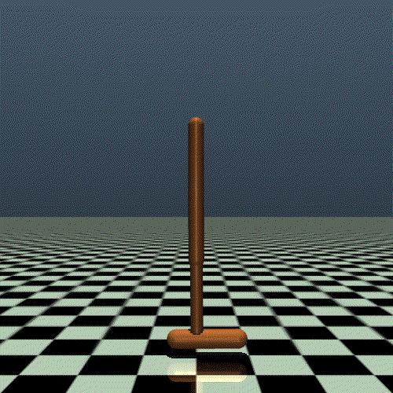
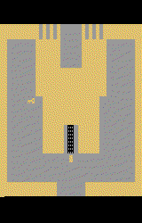

<div align="center">

</div>

# XuanCe: A Comprehensive and Unified Deep Reinforcement Learning Library

[](https://pypi.org/project/xuance/)
[](https://xuance.readthedocs.io)
[](https://github.com/agi-brain/xuance/blob/master/LICENSE.txt)
[](https://pepy.tech/project/xuance)
[](https://github.com/agi-brain/xuance/stargazers)
[](https://github.com/agi-brain/xuance/forks)
[](https://github.com/agi-brain/xuance/watchers)

[](https://pytorch.org/get-started/locally/)
[](https://www.tensorflow.org/install)
[](https://www.mindspore.cn/install/en)
[](https://www.gymlibrary.dev/)
[](https://pettingzoo.farama.org/)


**[Full Documentation](https://xuance.readthedocs.io/en/latest/)**
| **[README_CN.md](README_CN.md)**
| **[中文文档](https://xuance.readthedocs.io/zh/latest/)**

**XuanCe** is an open-source ensemble of Deep Reinforcement Learning (DRL) algorithm implementations.

We call it as **Xuan-Ce (玄策)** in Chinese.
"**Xuan (玄)**" means incredible and magic box, "**Ce (策)**" means policy.

DRL algorithms are sensitive to hyper-parameters tuning, varying in performance with different tricks,
and suffering from unstable training processes, therefore, sometimes DRL algorithms seems elusive and "Xuan".
This project gives a thorough, high-quality and easy-to-understand implementation of DRL algorithms,
and hope this implementation can give a hint on the magics of reinforcement learning.

We expect it to be compatible with multiple deep learning toolboxes(
**[PyTorch](https://pytorch.org/)**,
**[TensorFlow](https://www.tensorflow.org/)**, and
**[MindSpore](https://www.mindspore.cn/en)**),
and hope it can really become a zoo full of DRL algorithms.

Paper link: [https://arxiv.org/pdf/2312.16248.pdf](https://arxiv.org/pdf/2312.16248.pdf)

## Table of Contents:

- [**Features**](#features)
- [**Algorithms**](#algorithms)
- [**Environments**](#environments)
- [**Installation**](#point_right-installation)
- [**Quickly Start**](#point_right-quickly-start)
- [**Community**](#community)
- [**Citation**](#citations)

## Features

- :school_satchel: Highly modularized.
- :thumbsup: Easy to [learn](https://xuance.readthedocs.io/en/latest/), easy for [installation](https://xuance.readthedocs.io/en/latest/documents/usage/installation.html), and easy for [usage](https://xuance.readthedocs.io/en/latest/documents/usage/basic_usage.html).
- :twisted_rightwards_arrows: Flexible for model combination.
- :tada: Abundant [algorithms](https://xuance.readthedocs.io/en/latest/#list-of-algorithms) with various tasks.
- :couple: Supports both DRL and MARL tasks.
- :key: High compatibility for different users. (PyTorch, TensorFlow2, MindSpore, CPU, GPU, Linux, Windows, MacOS, etc.)
- :zap: Fast running speed with parallel environments. 
- :computer: Distributed training with multi-GPUs.
- 🎛️ Support automatically hyperparameters tuning.
- :chart_with_upwards_trend: Good visualization effect with [tensorboard](https://www.tensorflow.org/tensorboard) or [wandb](https://wandb.ai/site) tool.

## Algorithms

### :point_right: DRL

- **DQN**: Deep Q Network [[Paper](https://www.nature.com/articles/nature14236)]
- **Double DQN**: DQN with Double Q-learning [[Paper](https://ojs.aaai.org/index.php/AAAI/article/view/10295)]
- **Dueling DQN**: DQN with Dueling Network [[Paper](http://proceedings.mlr.press/v48/wangf16.pdf)]
- **PER**: DQN with Prioritized Experience Replay [[Paper](https://arxiv.org/pdf/1511.05952.pdf)]
- **NoisyDQN**: DQN with Parameter Space Noise for Exploration [[Paper](https://arxiv.org/pdf/1706.01905.pdf)]
- **DRQN**: Deep Recurrent Q-Network [[Paper](https://cdn.aaai.org/ocs/11673/11673-51288-1-PB.pdf)]
- **QRDQN**: DQN with Quantile Regression [[Paper](https://ojs.aaai.org/index.php/AAAI/article/view/11791)]
- **C51**: Distributional Reinforcement Learning [[Paper](http://proceedings.mlr.press/v70/bellemare17a/bellemare17a.pdf)]
- **PG**: Vanilla Policy Gradient [[Paper](https://proceedings.neurips.cc/paper_files/paper/1999/file/464d828b85b0bed98e80ade0a5c43b0f-Paper.pdf)]
- **NPG**: Natural Policy Gradient [[Paper](https://proceedings.neurips.cc/paper_files/paper/2001/file/4b86abe48d358ecf194c56c69108433e-Paper.pdf)]
- **PPG**: Phasic Policy Gradient [[Paper](http://proceedings.mlr.press/v139/cobbe21a/cobbe21a.pdf)] [[Code](https://github.com/openai/phasic-policy-gradient)]
- **A2C**: Advantage Actor Critic [[Paper](http://proceedings.mlr.press/v48/mniha16.pdf)] [[Code](https://github.com/openai/baselines/tree/master/baselines/a2c)]
- **SAC**: Soft Actor-Critic [[Paper](http://proceedings.mlr.press/v80/haarnoja18b/haarnoja18b.pdf)] [[Code](http://github.com/haarnoja/sac)]
- **SAC-Discrete**: Soft Actor-Critic for Discrete Actions [[Paper](https://arxiv.org/pdf/1910.07207.pdf)] [[Code](https://github.com/p-christ/Deep-Reinforcement-Learning-Algorithms-with-PyTorch)]
- **PPO-Clip**: Proximal Policy Optimization with Clipped Objective [[Paper](https://arxiv.org/pdf/1707.06347.pdf)] [[Code]( https://github.com/berkeleydeeprlcourse/homework/tree/master/hw4)]
- **PPO-KL**: Proximal Policy Optimization with KL Divergence [[Paper](https://arxiv.org/pdf/1707.06347.pdf)] [[Code]( https://github.com/berkeleydeeprlcourse/homework/tree/master/hw4)]
- **DDPG**: Deep Deterministic Policy Gradient [[Paper](https://arxiv.org/pdf/1509.02971.pdf)] [[Code](https://github.com/openai/baselines/tree/master/baselines/ddpg)]
- **TD3**: Twin Delayed Deep Deterministic Policy Gradient [[Paper](http://proceedings.mlr.press/v80/fujimoto18a/fujimoto18a.pdf)][[Code](https://github.com/sfujim/TD3)]
- **P-DQN**: Parameterised Deep Q-Network [[Paper](https://arxiv.org/pdf/1810.06394.pdf)]
- **MP-DQN**: Multi-pass Parameterised Deep Q-network [[Paper](https://arxiv.org/pdf/1905.04388.pdf)] [[Code](https://github.com/cycraig/MP-DQN)]
- **SP-DQN**: Split Parameterised Deep Q-Network [[Paper](https://arxiv.org/pdf/1810.06394.pdf)]

### :point_right: Model-Based Reinforcement Learning (MBRL)

- **DreamerV2** [[Paper](https://openreview.net/pdf?id=0oabwyZbOu)] [[Code](https://github.com/danijar/dreamerv2.git)]
- **DreamerV3** [[Paper](https://www.nature.com/articles/s41586-025-08744-2.pdf)] [[Code](https://github.com/danijar/dreamerv3.git)]
- **HarmonyDream** [[Paper](https://proceedings.mlr.press/v235/ma24o.html)] [[Code](https://github.com/thuml/HarmonyDream.git)]

### :point_right: Multi-Agent Reinforcement Learning (MARL)

- **IQL**: Independent Q-learning [[Paper](https://hal.science/file/index/docid/720669/filename/Matignon2012independent.pdf)] [[Code](https://github.com/oxwhirl/pymarl)]
- **VDN**: Value Decomposition Networks [[Paper](https://arxiv.org/pdf/1706.05296.pdf)] [[Code](https://github.com/oxwhirl/pymarl)]
- **QMIX**: Q-mixing networks [[Paper](http://proceedings.mlr.press/v80/rashid18a/rashid18a.pdf)] [[Code](https://github.com/oxwhirl/pymarl)]
- **WQMIX**: Weighted Q-mixing networks [[Paper](https://proceedings.neurips.cc/paper/2020/file/73a427badebe0e32caa2e1fc7530b7f3-Paper.pdf)] [[Code](https://github.com/oxwhirl/wqmix)]
- **QTRAN**: Q-transformation [[Paper](http://proceedings.mlr.press/v97/son19a/son19a.pdf)] [[Code](https://github.com/Sonkyunghwan/QTRAN)]
- **DCG**: Deep Coordination Graphs [[Paper](http://proceedings.mlr.press/v119/boehmer20a/boehmer20a.pdf)] [[Code](https://github.com/wendelinboehmer/dcg)]
- **IDDPG**: Independent Deep Deterministic Policy Gradient [[Paper](https://proceedings.neurips.cc/paper/2017/file/68a9750337a418a86fe06c1991a1d64c-Paper.pdf)]
- **MADDPG**: Multi-agent Deep Deterministic Policy Gradient [[Paper](https://proceedings.neurips.cc/paper/2017/file/68a9750337a418a86fe06c1991a1d64c-Paper.pdf)] [[Code](https://github.com/openai/maddpg)]
- **IAC**: Independent Actor-Critic [[Paper](https://ojs.aaai.org/index.php/AAAI/article/view/11794)] [[Code](https://github.com/oxwhirl/pymarl)]
- **COMA**: Counterfactual Multi-agent Policy Gradient [[Paper](https://ojs.aaai.org/index.php/AAAI/article/view/11794)] [[Code](https://github.com/oxwhirl/pymarl)]
- **VDAC**: Value-Decomposition Actor-Critic [[Paper](https://ojs.aaai.org/index.php/AAAI/article/view/17353)] [[Code](https://github.com/hahayonghuming/VDACs.git)]
- **IPPO**: Independent Proximal Policy Optimization [[Paper](https://proceedings.neurips.cc/paper_files/paper/2022/file/9c1535a02f0ce079433344e14d910597-Paper-Datasets_and_Benchmarks.pdf)] [[Code](https://github.com/marlbenchmark/on-policy)]
- **MAPPO**: Multi-agent Proximal Policy Optimization [[Paper](https://proceedings.neurips.cc/paper_files/paper/2022/file/9c1535a02f0ce079433344e14d910597-Paper-Datasets_and_Benchmarks.pdf)] [[Code](https://github.com/marlbenchmark/on-policy)]
- **MFQ**: Mean-Field Q-learning [[Paper](http://proceedings.mlr.press/v80/yang18d/yang18d.pdf)] [[Code](https://github.com/mlii/mfrl)]
- **MFAC**: Mean-Field Actor-Critic [[Paper](http://proceedings.mlr.press/v80/yang18d/yang18d.pdf)] [[Code](https://github.com/mlii/mfrl)]
- **ISAC**: Independent Soft Actor-Critic
- **MASAC**: Multi-agent Soft Actor-Critic [[Paper](https://arxiv.org/pdf/2104.06655.pdf)]
- **MATD3**: Multi-agent Twin Delayed Deep Deterministic Policy Gradient [[Paper](https://arxiv.org/pdf/1910.01465.pdf)]
- **IC3Net**: Individualized Controlled Continuous Communication Model [[Paper](https://arxiv.org/pdf/1812.09755)] [[Code](https://github.com/IC3Net/IC3Net.git)]
- **CommNet**: Communication Neural Net [[Paper](https://proceedings.neurips.cc/paper_files/paper/2016/file/55b1927fdafef39c48e5b73b5d61ea60-Paper.pdf)][[Code](https://github.com/cts198859/deeprl_network.git)]

### :point_right: Contrastive Reinforcement Learning (CRL)
- **CURL**: Contrastive Unsupervised Representation Learning for Sample-Efficient Reinforcement Learning [[Paper](http://proceedings.mlr.press/v119/laskin20a/laskin20a.pdf)] [[Code](https://github.com/MishaLaskin/curl/blob/master/curl_sac.py)]
- **SPR**: Data-Efficient Reinforcement Learning with Self-Predictive Representations [[Paper]](https://arxiv.org/abs/2007.05929) [[Code]](https://github.com/mila-iqia/spr)
- **DrQ**: Image Augmentation Is All You Need: Regularizing Deep Reinforcement Learning from Pixels [[Paper]](https://openreview.net/forum?id=GY6-6sTvGaf) [[Code]](https://sites.google.com/view/data-regularized-q)
## Environments

### [Classic Control](https://xuance.readthedocs.io/en/latest/documents/api/environments/single_agent_env/gym.html#classic-control)

<table rules="none" align="center"><tr>
<td> <center>
<br/><font color="AAAAAA">Cart Pole</font>
</center></td>
<td> <center>
 <br/> <font color="AAAAAA">Pendulum</font>
</center> </td>
<td> <center>
 <br/> <font color="AAAAAA">Acrobot</font>
</center> </td>
<td> <center>
 <br/> <font color="AAAAAA">MountainCar</font>
</center> </td>
</table>

### [Box2D](https://xuance.readthedocs.io/en/latest/documents/api/environments/single_agent_env/gym.html#box2d)

<table rules="none" align="center"><tr>
<td> <center>
<br/><font color="AAAAAA">Bipedal Walker</font>
</center></td>
<td> <center>
 <br/> <font color="AAAAAA">Car Racing</font>
</center> </td>
<td> <center>
 <br/> <font color="AAAAAA">Lunar Lander</font>
</center> </td>
</tr>
</table>

### [MuJoCo Environments](https://xuance.readthedocs.io/en/latest/documents/api/environments/single_agent_env/gym.html#mujoco)

<table rules="none" align="center"><tr>
<td> <center>
<br/><font color="AAAAAA">Ant</font>
</center></td>
<td> <center>
 <br/> <font color="AAAAAA">HalfCheetah</font>
</center> </td>
<td> <center>
 <br/> <font color="AAAAAA">Hopper</font>
</center> </td>
<td> <center>
 <br/> <font color="AAAAAA">HumanoidStandup</font>
</center> </td>
<td> <center>
 <br/> <font color="AAAAAA">Humanoid</font>
</center> </td>
<td> <center>
 <br/> <font color="AAAAAA">InvertedPendulum</font>
</center> </td>
<td> <center>
<br/> <font color="AAAAAA">...</font>
</center> </td>
</tr>
</table>

### [Atari Environments](https://xuance.readthedocs.io/en/latest/documents/api/environments/single_agent_env/gym.html#atari)

<table rules="none" align="center"><tr>
<td> <center>
 <br/> <font color="AAAAAA">Adventure</font>
</center> </td>
<td> <center>
 <br/> <font color="AAAAAA">Air Raid</font>
</center> </td>
<td> <center>
 <br/> <font color="AAAAAA">Alien</font>
</center> </td>
<td> <center>
<br/><font color="AAAAAA">Amidar</font>
</center></td>
<td> <center>
 <br/> <font color="AAAAAA">Assault</font>
</center> </td>
<td> <center>
 <br/> <font color="AAAAAA">Asterix</font>
</center> </td>
<td> <center>
 <br/> <font color="AAAAAA">Asteroids</font>
</center> </td>
<td> <center>
<br/> <font color="AAAAAA">...</font>
</center> </td>
</tr>
</table>

### [Minigrid Environments](https://xuance.readthedocs.io/en/latest/documents/api/environments/single_agent_env/minigrid.html)

<table rules="none" align="center"><tr>
<td> <center>
<br/><font color="AAAAAA">GoToDoorEnv</font>
</center></td>
<td> <center>
 <br/> <font color="AAAAAA">LockedRoomEnv</font>
</center> </td>
<td> <center>
 <br/> <font color="AAAAAA">MemoryEnv</font>
</center> </td>
<td> <center>
 <br/> <font color="AAAAAA">PlaygroundEnv</font>
</center> </td>
<td> <center>
<br/> <font color="AAAAAA">...</font>
</center> </td>
</tr>
</table>

### [Drones Environments](https://xuance.readthedocs.io/en/latest/documents/api/environments/multi_agent_env/drones.html)

<table rules="none" align="center"><tr>
<td> <center>
<br/><font color="AAAAAA">Helix</font>
</center></td>
<td> <center>
 <br/> <font color="AAAAAA">Single-Agent Hover</font>
</center> </td>
<td> <center>
 <br/> <font color="AAAAAA">Multi-Agent Hover</font>
</center> </td>
<td> <center>
<br/> <font color="AAAAAA">...</font>
</center> </td>
</tr>
</table>

### [MetaDrive](https://xuance.readthedocs.io/en/latest/documents/api/environments/single_agent_env/metadrive.html)

<div align="center">

</div>

### [MPE Environments](https://xuance.readthedocs.io/en/latest/documents/api/environments/multi_agent_env/mpe.html)

<table rules="none" align="center"><tr>
<td> <center>
<br/><font color="AAAAAA">Simple Push</font>
</center></td>
<td> <center>
 <br/> <font color="AAAAAA">Simple Reference</font>
</center> </td>
<td> <center>
 <br/> <font color="AAAAAA">Simple Spread</font>
</center> </td>
<td> <center>
 <br/> <font color="AAAAAA">Simple Adversary</font>
</center> </td>
<td> <center>
<br/> <font color="AAAAAA">...</font>
</center> </td>
</tr>
</table>

### [Robotic Warehouse](https://xuance.readthedocs.io/en/latest/documents/api/environments/multi_agent_env/robotic_warehouse.html)

<table rules="none" align="center"><tr>
<td> <center>
<br/><font color="AAAAAA">Example 1</font>
</center></td>
<td> <center>
 <br/> <font color="AAAAAA">Example 2</font>
</center> </td>
<td> <center>
 <br/> <font color="AAAAAA">Example 3</font>
</center> </td>
<td> <center>
 <br/> <font color="AAAAAA">Example 4</font>
</center> </td>
<td> <center>
<br/> <font color="AAAAAA">...</font>
</center> </td>
</tr>
</table>

[//]: # (### [Magent2]&#40;https://magent2.farama.org/&#41;)

[//]: #
[//]: # (<details open>)

[//]: # (<summary>&#40;Click to hide&#41;</summary>)

[//]: #
[//]: # (<table rules="none" align="center"><tr>)

[//]: # (<td> <center>)

[//]: # (<br/><font color="AAAAAA">Battle</font>)

[//]: # (</center></td>)

[//]: # (<td> <center>)

[//]: # ( <br/> <font color="AAAAAA">Tiger Deer</font>)

[//]: # (</center> </td>)

[//]: # (<td> <center>)

[//]: # ( <br/> <font color="AAAAAA">Battle Field</font>)

[//]: # (</center> </td>)

[//]: # (<td> <center>)

[//]: # (<br/> <font color="AAAAAA">...</font>)

[//]: # (</center> </td>)

[//]: # (</tr>)

[//]: # (</table>)

[//]: #
[//]: # (</details>)

### [SMAC](https://xuance.readthedocs.io/en/latest/documents/api/environments/multi_agent_env/smac.html)

<div align="center">

</div>

### [Google Research Football](https://xuance.readthedocs.io/en/latest/documents/api/environments/multi_agent_env/football.html)

<div align="center">

</div>

## :point_right: Installation

:computer: The library can be run at Linux, Windows, MacOS, and EulerOS, etc.

Before installing **XuanCe**, you should install [Anaconda](https://www.anaconda.com/download) to prepare a python
environment.
(Note: select a proper version of Anaconda from [**here**](https://repo.anaconda.com/archive/).)

After that, open a terminal and install **XuanCe** by the following steps.

**Step 1**: Create and activate a new conda environment (python>=3.7 is suggested):

```bash
conda create -n xuance_env python=3.8 && conda activate xuance_env
```

**Step 2**: Install the mpi4py dependency:

```bash
conda install mpi4py
```

**Step 3**: Install the library:

```bash
pip install xuance
```

This command does not include the dependencies of deep learning toolboxes. To install the **XuanCe** with
deep learning tools, you can type `pip install xuance[torch]` for [PyTorch](https://pytorch.org/get-started/locally/),
`pip install xuance[tensorflow]` for [TensorFlow2](https://www.tensorflow.org/install),
`pip install xuance[mindspore]` for [MindSpore](https://www.mindspore.cn/install/en),
and `pip install xuance[all]` for all dependencies.

Note: Some extra packages should be installed manually for further usage.
Click [**here**](https://xuance.readthedocs.io/en/latest/documents/usage/installation.html) to see more details for installation.

## :point_right: Quickly Start

### Train a Model

```python
import xuance

runner = xuance.get_runner(method='dqn',
                           env='classic_control',
                           env_id='CartPole-v1',
                           is_test=False)
runner.run()
```

### Test the Model

```python
import xuance

runner_test = xuance.get_runner(method='dqn',
                                env='classic_control',
                                env_id='CartPole-v1',
                                is_test=True)
runner_test.run()
```

### Visualize the results

#### Tensorboard

You can use tensorboard to visualize what happened in the training process. After training, the log file will be
automatically generated in the directory ".results/" and you should be able to see some training data after running the
command.

``` 
$ tensorboard --logdir ./logs/dqn/torch/CartPole-v0
```
<div align="center">

</div>

#### Weights & Biases (wandb)

XuanCe also supports Weights & Biases (wandb) tools for users to visualize the results of the running implementation.

How to use wandb online? :arrow_right: [https://github.com/wandb/wandb.git/](https://github.com/wandb/wandb.git/) 

How to use wandb offline? :arrow_right: [https://github.com/wandb/server.git/](https://github.com/wandb/server.git/)

<div align="center">

</div>

<!-- If everything going well, you should get a similar display like below. 

 -->

## Community

- GitHub issues: [https://github.com/agi-brain/xuance/issues](https://github.com/agi-brain/xuance/issues)
- Github discussions: [https://github.com/orgs/agi-brain/discussions](https://github.com/orgs/agi-brain/discussions)
- Discord invite link: [https://discord.gg/HJn2TBQS7y](https://discord.gg/HJn2TBQS7y)
- Slack invite link: [https://join.slack.com/t/xuancerllib/](https://join.slack.com/t/xuancerllib/shared_invite/zt-2x2r98msi-iMX6mSVcgWwXYj95abcXIw)
- QQ App's group number: 552432695 (Full), 153966755
- WeChat account: "玄策 RLlib"

(Note: You can also post your questions on [Stack Overflow](https://stackoverflow.com/).)

<details open>
<summary>(QR code for QQ group and WeChat official account)</summary>

<table rules="none" align="center"><tr>
<td> <center>
<br/><font color="AAAAAA">QQ group</font>
</center></td>
<td> <center>
 <br/> <font color="AAAAAA">Official account (WeChat)</font>
</center> </td>
</tr>
</table>

</details>

## Citations

If you use XuanCe in your research or development, please cite the paper:

```
@article{liu2023xuance,
  title={XuanCe: A Comprehensive and Unified Deep Reinforcement Learning Library},
  author={Liu, Wenzhang and Cai, Wenzhe and Jiang, Kun and Cheng, Guangran and Wang, Yuanda and Wang, Jiawei and Cao, Jingyu and Xu, Lele and Mu, Chaoxu and Sun, Changyin},
  journal={arXiv preprint arXiv:2312.16248},
  year={2023}
}
```
