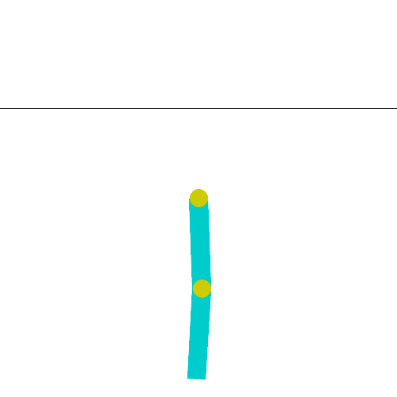
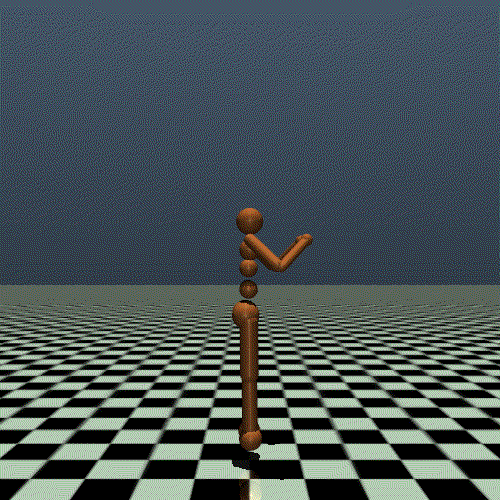
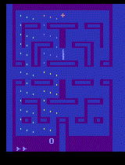
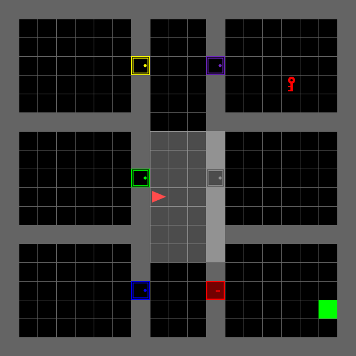
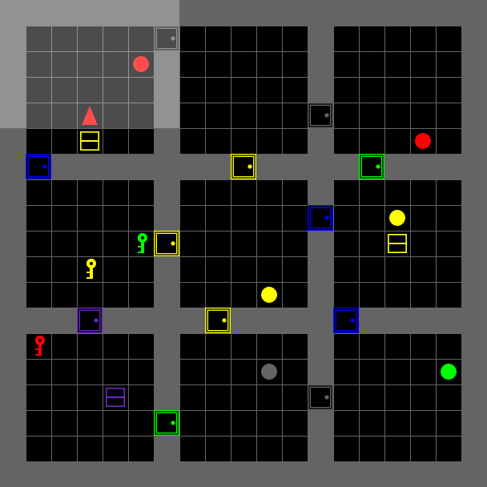
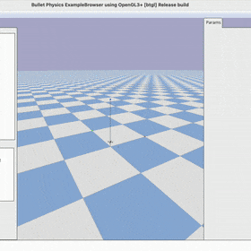
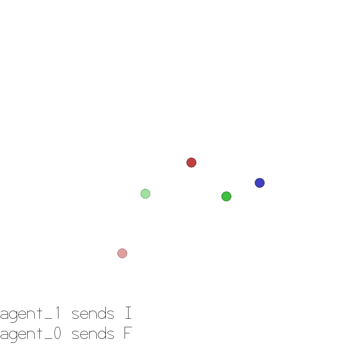
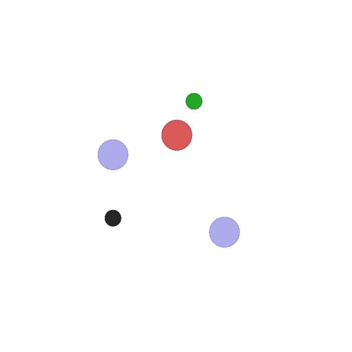
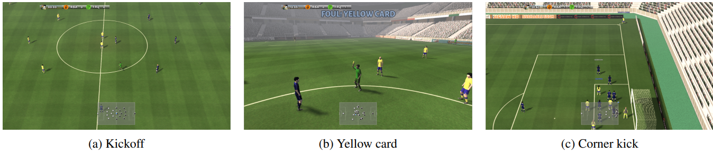

<div align="center">

</div>

# XuanCe: 一个全面且统一的深度强化学习库

[](https://pypi.org/project/xuance/)
[](https://xuance.readthedocs.io)
[](https://github.com/agi-brain/xuance/blob/master/LICENSE.txt)
[](https://pepy.tech/project/xuance)
[](https://github.com/agi-brain/xuance/stargazers)
[](https://github.com/agi-brain/xuance/forks)
[](https://github.com/agi-brain/xuance/watchers)

[](https://pytorch.org/get-started/locally/)
[](https://www.tensorflow.org/install)
[](https://www.mindspore.cn/install/en)

[](https://www.anaconda.com/download)
[](https://www.gymlibrary.dev/)
[](https://www.gymlibrary.dev/)
[](https://pettingzoo.farama.org/)

**[README.md](README.md)**
|**[英文文档](https://xuance.readthedocs.io/en/latest/)**
| **[中文文档](https://xuance.readthedocs.io/zh/latest/)**

**XuanCe** 是一个开源的深度强化学习（DRL）算法库。

我们将其称为 **Xuan-Ce（玄策）**。
“**玄（Xuan）**”寓意玄妙的，“**策（Ce）**”意为策略。

由于 DRL 算法通常对超参数敏感、效果易随技巧（tricks）的不同而差异较大，训练过程本身也不够稳定，因此 DRL 算法有时显得难以捉摸，带有“玄学”的意味。本项目致力于提供深入、优质、易懂的 DRL 算法实现，希望能揭示强化学习中这些“玄学”背后的原理。

我们期望它能兼容多种深度学习框架（**[PyTorch](https://pytorch.org/)**、**[TensorFlow](https://www.tensorflow.org/)** 和 **[MindSpore](https://www.mindspore.cn/en)**），并希望它能够成为涵盖多种 DRL 算法的智能决策框架。

论文链接：[https://arxiv.org/pdf/2312.16248.pdf](https://arxiv.org/pdf/2312.16248.pdf)

目录：
- [**项目特性**](#features-of-xuance)
- [**已实现算法**](#currently-included-algorithms)
- [**已支持环境**](#currently-supported-environments)
- [**安装方法**](#point_right-installation)
- [**快速上手**](#point_right-quickly-start)
- [**社区交流**](#community)
- [**引用**](#citations)

## 为什么选择 XuanCe？

### XuanCe 的特性

- :school_satchel: 高度模块化设计。
- :thumbsup: 易于[学习](https://xuance.readthedocs.io/en/latest/)，易于[安装](https://xuance.readthedocs.io/en/latest/documents/usage/installation.html)，易于[使用](https://xuance.readthedocs.io/en/latest/documents/usage/basic_usage.html)。
- :twisted_rightwards_arrows: 模型组合灵活。
- :tada: 提供大量[算法](https://xuance.readthedocs.io/en/latest/#list-of-algorithms)及多种任务支持。
- :couple: 同时支持 DRL 和 MARL（多智能体强化学习）任务。
- :key: 高度兼容不同用户需求。（PyTorch、TensorFlow2、MindSpore、CPU、GPU、Linux、Windows、MacOS 等）
- :zap: 支持环境并行，运行速度快。
- :computer: 支持多 GPU 分布式训练。
- 🎛️ 支持自动化超参数调优。
- :chart_with_upwards_trend: 与 [tensorboard](https://www.tensorflow.org/tensorboard) 或 [wandb](https://wandb.ai/site) 工具结合，具备良好可视化效果。

## 已实现算法

### :point_right: DRL

- **DQN**: Deep Q Network [[论文](https://www.nature.com/articles/nature14236)]
- **Double DQN**: DQN with Double Q-learning [[论文](https://ojs.aaai.org/index.php/AAAI/article/view/10295)]
- **Dueling DQN**: DQN with Dueling Network [[论文](http://proceedings.mlr.press/v48/wangf16.pdf)]
- **PER**: DQN with Prioritized Experience Replay [[论文](https://arxiv.org/pdf/1511.05952.pdf)]
- **NoisyDQN**: DQN with Parameter Space Noise for Exploration [[论文](https://arxiv.org/pdf/1706.01905.pdf)]
- **DRQN**: Deep Recurrent Q-Netwrk [[论文](https://cdn.aaai.org/ocs/11673/11673-51288-1-PB.pdf)]
- **QRDQN**: DQN with Quantile Regression [[论文](https://ojs.aaai.org/index.php/AAAI/article/view/11791)]
- **C51**: Distributional Reinforcement Learning [[论文](http://proceedings.mlr.press/v70/bellemare17a/bellemare17a.pdf)]
- **PG**: Vanilla Policy Gradient [[论文](https://proceedings.neurips.cc/paper_files/paper/1999/file/464d828b85b0bed98e80ade0a5c43b0f-Paper.pdf)]
- **NPG**: Natural Policy Gradient [[论文](https://proceedings.neurips.cc/paper_files/paper/2001/file/4b86abe48d358ecf194c56c69108433e-Paper.pdf)]
- **PPG**: Phasic Policy Gradient [[论文](http://proceedings.mlr.press/v139/cobbe21a/cobbe21a.pdf)] [[源码](https://github.com/openai/phasic-policy-gradient)]
- **A2C**: Advantage Actor Critic [[论文](http://proceedings.mlr.press/v48/mniha16.pdf)] [[源码](https://github.com/openai/baselines/tree/master/baselines/a2c)]
- **SAC**: Soft Actor-Critic [[论文](http://proceedings.mlr.press/v80/haarnoja18b/haarnoja18b.pdf)] [[源码](http://github.com/haarnoja/sac)]
- **SAC-Discrete**: Soft Actor-Critic for Discrete Actions [[论文](https://arxiv.org/pdf/1910.07207.pdf)] [[源码](https://github.com/p-christ/Deep-Reinforcement-Learning-Algorithms-with-PyTorch)]
- **PPO-Clip**: Proximal Policy Optimization with Clipped Objective [[论文](https://arxiv.org/pdf/1707.06347.pdf)] [[源码]( https://github.com/berkeleydeeprlcourse/homework/tree/master/hw4)]
- **PPO-KL**: Proximal Policy Optimization with KL Divergence [[论文](https://arxiv.org/pdf/1707.06347.pdf)] [[源码]( https://github.com/berkeleydeeprlcourse/homework/tree/master/hw4)]
- **DDPG**: Deep Deterministic Policy Gradient [[论文](https://arxiv.org/pdf/1509.02971.pdf)] [[源码](https://github.com/openai/baselines/tree/master/baselines/ddpg)]
- **TD3**: Twin Delayed Deep Deterministic Policy Gradient [[论文](http://proceedings.mlr.press/v80/fujimoto18a/fujimoto18a.pdf)][[源码](https://github.com/sfujim/TD3)]
- **P-DQN**: Parameterised Deep Q-Network [[论文](https://arxiv.org/pdf/1810.06394.pdf)]
- **MP-DQN**: Multi-pass Parameterised Deep Q-network [[论文](https://arxiv.org/pdf/1905.04388.pdf)] [[源码](https://github.com/cycraig/MP-DQN)]
- **SP-DQN**: Split Parameterised Deep Q-Network [[论文](https://arxiv.org/pdf/1810.06394.pdf)]

### :point_right: Model-Based Reinforcement Learning (MBRL)

- **DreamerV2** [[论文](https://openreview.net/pdf?id=0oabwyZbOu)] [[源码](https://github.com/danijar/dreamerv2.git)]
- **DreamerV3** [[论文](https://www.nature.com/articles/s41586-025-08744-2.pdf)] [[源码](https://github.com/danijar/dreamerv3.git)]
- **HarmonyDream** [[论文](https://proceedings.mlr.press/v235/ma24o.html)] [[源码](https://github.com/thuml/HarmonyDream.git)]

### :point_right: Multi-Agent Reinforcement Learning (MARL)

- **IQL**: Independent Q-learning [[论文](https://hal.science/file/index/docid/720669/filename/Matignon2012independent.pdf)] [[源码](https://github.com/oxwhirl/pymarl)]
- **VDN**: Value Decomposition Networks [[论文](https://arxiv.org/pdf/1706.05296.pdf)] [[源码](https://github.com/oxwhirl/pymarl)]
- **QMIX**: Q-mixing networks [[论文](http://proceedings.mlr.press/v80/rashid18a/rashid18a.pdf)] [[源码](https://github.com/oxwhirl/pymarl)]
- **WQMIX**: Weighted Q-mixing networks [[论文](https://proceedings.neurips.cc/paper/2020/file/73a427badebe0e32caa2e1fc7530b7f3-Paper.pdf)] [[源码](https://github.com/oxwhirl/wqmix)]
- **QTRAN**: Q-transformation [[论文](http://proceedings.mlr.press/v97/son19a/son19a.pdf)] [[源码](https://github.com/Sonkyunghwan/QTRAN)]
- **DCG**: Deep Coordination Graphs [[论文](http://proceedings.mlr.press/v119/boehmer20a/boehmer20a.pdf)] [[源码](https://github.com/wendelinboehmer/dcg)]
- **IDDPG**: Independent Deep Deterministic Policy Gradient [[论文](https://proceedings.neurips.cc/paper/2017/file/68a9750337a418a86fe06c1991a1d64c-Paper.pdf)]
- **MADDPG**: Multi-agent Deep Deterministic Policy Gradient [[论文](https://proceedings.neurips.cc/paper/2017/file/68a9750337a418a86fe06c1991a1d64c-Paper.pdf)] [[源码](https://github.com/openai/maddpg)]
- **IAC**: Independent Actor-Critic [[论文](https://ojs.aaai.org/index.php/AAAI/article/view/11794)] [[源码](https://github.com/oxwhirl/pymarl)]
- **COMA**: Counterfactual Multi-agent Policy Gradient [[论文](https://ojs.aaai.org/index.php/AAAI/article/view/11794)] [[源码](https://github.com/oxwhirl/pymarl)]
- **VDAC**: Value-Decomposition Actor-Critic [[论文](https://ojs.aaai.org/index.php/AAAI/article/view/17353)] [[源码](https://github.com/hahayonghuming/VDACs.git)]
- **IPPO**: Independent Proximal Policy Optimization [[论文](https://proceedings.neurips.cc/paper_files/paper/2022/file/9c1535a02f0ce079433344e14d910597-Paper-Datasets_and_Benchmarks.pdf)] [[源码](https://github.com/marlbenchmark/on-policy)]
- **MAPPO**: Multi-agent Proximal Policy Optimization [[论文](https://proceedings.neurips.cc/paper_files/paper/2022/file/9c1535a02f0ce079433344e14d910597-Paper-Datasets_and_Benchmarks.pdf)] [[源码](https://github.com/marlbenchmark/on-policy)]
- **MFQ**: Mean-Field Q-learning [[论文](http://proceedings.mlr.press/v80/yang18d/yang18d.pdf)] [[源码](https://github.com/mlii/mfrl)]
- **MFAC**: Mean-Field Actor-Critic [[论文](http://proceedings.mlr.press/v80/yang18d/yang18d.pdf)] [[源码](https://github.com/mlii/mfrl)]
- **ISAC**: Independent Soft Actor-Critic
- **MASAC**: Multi-agent Soft Actor-Critic [[论文](https://arxiv.org/pdf/2104.06655.pdf)]
- **MATD3**: Multi-agent Twin Delayed Deep Deterministic Policy Gradient [[论文](https://arxiv.org/pdf/1910.01465.pdf)]
- **IC3Net**: Individualized Controlled Continuous Communication Model [[论文](https://arxiv.org/pdf/1812.09755)] [[源码](https://github.com/IC3Net/IC3Net.git)]
- **CommNet**: Communication Neural Net [[Paper](https://proceedings.neurips.cc/paper_files/paper/2016/file/55b1927fdafef39c48e5b73b5d61ea60-Paper.pdf)][[源码](https://github.com/cts198859/deeprl_network.git)]
- **TarMAC**: Targeted Multi-Agent Communication [[Paper](https://proceedings.mlr.press/v97/das19a)]

### :point_right: Contrastive Reinforcement Learning (CRL)
- **CURL**: Contrastive Unsupervised Representation Learning for Sample-Efficient Reinforcement Learning [[Paper](http://proceedings.mlr.press/v119/laskin20a/laskin20a.pdf)] [[源码](https://github.com/MishaLaskin/curl/blob/master/curl_sac.py)]
- **SPR**: Data-Efficient Reinforcement Learning with Self-Predictive Representations [[Paper]](https://arxiv.org/abs/2007.05929) [[源码]](https://github.com/mila-iqia/spr)

## 已支持环境

### [Classic Control](https://www.gymlibrary.dev/environments/classic_control/)

<details open>
<summary>（点击收起/展开）</summary>

<table rules="none" align="center"><tr>
<td> <center>
<br/><font color="AAAAAA">Cart Pole</font>
</center></td>
<td> <center>
 <br/> <font color="AAAAAA">Pendulum</font>
</center> </td>
<td> <center>
 <br/> <font color="AAAAAA">Acrobot</font>
</center> </td>
<td> <center>
<br/> <font color="AAAAAA">...</font>
</tr>
</table>

</details>

### [Box2D](https://www.gymlibrary.dev/environments/box2d/)

<details open>
<summary>（点击收起/展开）</summary>

<table rules="none" align="center"><tr>
<td> <center>
<br/><font color="AAAAAA">Bipedal Walker</font>
</center></td>
<td> <center>
 <br/> <font color="AAAAAA">Car Racing</font>
</center> </td>
<td> <center>
 <br/> <font color="AAAAAA">Lunar Lander</font>
</center> </td>
</tr>
</table>

</details>

### [MuJoCo 环境](https://www.gymlibrary.dev/environments/mujoco/)

<details open>
<summary>（点击收起/展开）</summary>

<table rules="none" align="center"><tr>
<td> <center>
<br/><font color="AAAAAA">Ant</font>
</center></td>
<td> <center>
 <br/> <font color="AAAAAA">HalfCheetah</font>
</center> </td>
<td> <center>
 <br/> <font color="AAAAAA">Hopper</font>
</center> </td>
<td> <center>
 <br/> <font color="AAAAAA">Humanoid</font>
</center> </td>
<td> <center>
<br/> <font color="AAAAAA">...</font>
</center> </td>
</tr>
</table>
</details>

### [Atari 环境](https://www.gymlibrary.dev/environments/atari/)

<details open>
<summary>（点击收起/展开）</summary>

<table rules="none" align="center"><tr>
<td> <center>
 <br/> <font color="AAAAAA">Adventure</font>
</center> </td>
<td> <center>
 <br/> <font color="AAAAAA">Air Raid</font>
</center> </td>
<td> <center>
 <br/> <font color="AAAAAA">Alien</font>
</center> </td>
<td> <center>
<br/><font color="AAAAAA">Amidar</font>
</center></td>
<td> <center>
 <br/> <font color="AAAAAA">Assault</font>
</center> </td>
<td> <center>
<br/> <font color="AAAAAA">...</font>
</center> </td>
</tr>
</table>

</details>

### [Minigrid 环境](https://minigrid.farama.org/)

<details open>
<summary>（点击收起/展开）</summary>

<table rules="none" align="center"><tr>
<td> <center>
<br/><font color="AAAAAA">GoToDoorEnv</font>
</center></td>
<td> <center>
 <br/> <font color="AAAAAA">LockedRoomEnv</font>
</center> </td>
<td> <center>
 <br/> <font color="AAAAAA">MemoryEnv</font>
</center> </td>
<td> <center>
 <br/> <font color="AAAAAA">PlaygroundEnv</font>
</center> </td>
<td> <center>
<br/> <font color="AAAAAA">...</font>
</center> </td>
</tr>
</table>
</details>

### [无人机环境（Drones Environments）](https://github.com/utiasDSL/gym-pybullet-drones)

可参考 [XuanCe 文档中关于 gym-pybullet-drones 的安装与使用说明](https://xuance.readthedocs.io/en/latest/documents/api/environments/drones.html)。

<details open>
<summary>（点击收起/展开）</summary>

<table rules="none" align="center"><tr>
<td> <center>
<br/><font color="AAAAAA">Helix</font>
</center></td>
<td> <center>
 <br/> <font color="AAAAAA">单智能体 Hover</font>
</center> </td>
<td> <center>
 <br/> <font color="AAAAAA">多智能体 Hover</font>
</center> </td>
<td> <center>
<br/> <font color="AAAAAA">...</font>
</center> </td>
</tr>
</table>
</details>

### [MPE 环境](https://pettingzoo.farama.org/environments/mpe/)

<details open>
<summary>（点击收起/展开）</summary>

<table rules="none" align="center"><tr>
<td> <center>
<br/><font color="AAAAAA">Simple Push</font>
</center></td>
<td> <center>
 <br/> <font color="AAAAAA">Simple Reference</font>
</center> </td>
<td> <center>
 <br/> <font color="AAAAAA">Simple Spread</font>
</center> </td>
<td> <center>
 <br/> <font color="AAAAAA">Simple Adversary</font>
</center> </td>
<td> <center>
<br/> <font color="AAAAAA">...</font>
</center> </td>
</tr>
</table>

</details>

### [SMAC](https://github.com/oxwhirl/smac)

<div align="center">

</div>

### [Google Research Football](https://github.com/google-research/football)

<div align="center">

</div>

## :point_right: 安装方法

:computer: 本库可在 Linux、Windows、MacOS、EulerOS 等多种系统上运行。

在安装 **XuanCe** 之前，建议先安装 [Anaconda](https://www.anaconda.com/download)，以便准备一个 Python 环境。（注：可从[**此处**](https://repo.anaconda.com/archive/)选择合适版本的 Anaconda。）

安装步骤如下（在终端 / 命令行下执行）：

**步骤 1**：创建一个新的 conda 虚拟环境（建议 python>=3.7）：

```bash
conda create -n xuance_env python=3.7
```

**步骤 2**：激活该环境：

```bash
conda activate xuance_env
```

**步骤 3**：安装本库：

```bash
pip install xuance
```

上述命令不包含深度学习框架的依赖。如果需要同时安装特定的深度学习框架，可通过以下命令：
- 仅安装 PyTorch: pip install xuance[torch]
- 仅安装 TensorFlow2: pip install xuance[tensorflow]
- 仅安装 MindSpore: pip install xuance[mindspore]
- 一次性安装全部依赖: pip install xuance[all]

注意：如果还需要用到其他功能或特定的依赖，请手动安装相关包。

## :point_right: 快速上手

### 训练模型

```python
import xuance

runner = xuance.get_runner(method='dqn',
                           env='classic_control',
                           env_id='CartPole-v1',
                           is_test=False)
runner.run()
```

### 测试模型

```python
import xuance

runner_test = xuance.get_runner(method='dqn',
                                env='classic_control',
                                env_id='CartPole-v1',
                                is_test=True)
runner_test.run()
```

### 可视化训练结果

#### Tensorboard

可通过 Tensorboard 对训练过程进行可视化。训练完成后，日志文件将自动保存到“.results/”目录中。你可在终端输入以下命令进行查看：

```bash
tensorboard --logdir ./logs/dqn/torch/CartPole-v0
```

<div align="center">

</div>


#### Weights & Biases (wandb)

XuanCe 同样支持 Weights & Biases (wandb) 工具来可视化结果。
- 如何在线使用 wandb? :arrow_right: https://github.com/wandb/wandb.git/
- 如何离线使用 wandb? :arrow_right: https://github.com/wandb/server.git/

<div align="center">

</div>


社区交流
- GitHub issues: https://github.com/agi-brain/xuance/issues
- GitHub discussions: https://github.com/orgs/agi-brain/discussions
- Discord 邀请链接: https://discord.gg/HJn2TBQS7y
- Slack 邀请链接: https://join.slack.com/t/xuancerllib/
- QQ 1群：552432695（已满）
- QQ 2群：153966755
- 微信公众号：“玄策 RLlib”

（注：也可在 Stack Overflow 上提问。）

<details open>
<summary>（QQ 群与微信公众号二维码）</summary>


<table rules="none" align="center"><tr>
<td> <center>
<br/><font color="AAAAAA">QQ 群</font>
</center></td>
<td> <center>
 <br/> <font color="AAAAAA">微信公众号</font>
</center> </td>
</tr>
</table>


</details>


[@TFBestPractices](https://twitter.com/TFBestPractices/status/1665770204398223361)

### 引用

如果您在研究或开发中使用了 XuanCe，请引用以下论文：

```
@article{liu2023xuance,
  title={XuanCe: A Comprehensive and Unified Deep Reinforcement Learning Library},
  author={Liu, Wenzhang and Cai, Wenzhe and Jiang, Kun and Cheng, Guangran and Wang, Yuanda and Wang, Jiawei and Cao, Jingyu and Xu, Lele and Mu, Chaoxu and Sun, Changyin},
  journal={arXiv preprint arXiv:2312.16248},
  year={2023}
}
```