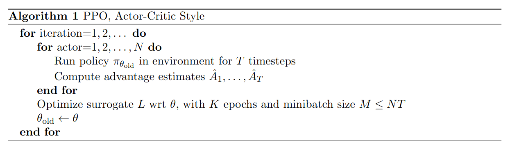

# Proximal Policy Optimization with Clipped Objective (PPO-Clip)
**Paper Link:** [**arxiv**](https://arxiv.org/pdf/1707.06347)

**Proximal Policy Optimization (PPO)** algorithm was developed by **John Schulman**, the first author of **Trust Region Policy Optimization (TRPO)**, 
at OpenAI in 2017 after graduating from his PhD at the University of California, Berkeley. 
Compared to TRPO, PPO retains the core concept of limiting the policy update 
step but significantly reduces its implementation complexity. TRPO's high computational complexity, 
particularly when calculating the Hessian matrix and performing second-order optimization, makes it unsuitable 
for situations with limited computing resources. 
PPO builds on the ideas of TRPO but offers a simpler implementation. 
Extensive experimental results demonstrate that PPO learns just as well (or even faster) than TRPO, 
making it a very popular reinforcement learning algorithm.

This table lists some general features about **PPO** algorithm:

| Features of PPO   | Values | Description                                              |
|-------------------|--------|----------------------------------------------------------|
| On-policy         | ✅      | The evaluate policy is the same as the target policy.    |
| Off-policy        | ❌      | The evaluate policy is different from the target policy. | 
| Model-free        | ✅      | No need to prepare an environment dynamics model.        | 
| Model-based       | ❌      | Need an environment model to train the policy.           | 
| Discrete Action   | ✅      | Deal with discrete action space.                         |   
| Continuous Action | ✅      | Deal with continuous action space.                       |

*The paper proposes two main PPO variants: PPO-KL and PPO-Clip. PPO-Clip was found to offer superior performance 
and stability, leading almost all subsequent PPO implementations to adopt the Clipped Surrogate Objective. 
This section focuses on PPO-Clip.*


## TRPO
Since the PPO algorithm is an improved method proposed based on the TRPO algorithm,
in order to have a deeper understanding of the principle of the PPO algorithm,
it is necessary to first analyze the core idea of the TRPO algorithm.

The TRPO algorithm was originally proposed by John Schulman et al. in [**Trust Region Policy Optimization**](https://proceedings.mlr.press/v37/schulman15.pdf) in 2015.
The paper introduced the concepts of a **trust region and a KL divergence constraint**.
Its key idea is to provide a security guarantee for policy performance when updating a policy within a trust region.
TRPO describes an iterative process for optimizing a policy that theoretically guarantees monotonic performance of 
policy learning and has achieved better results than the policy gradient algorithm in practical applications.

### Monotonicity Guarantee of Objective Function
TRPO points out the gap between the objective functions of the new and old policies:

$$
\begin{aligned}
J(\theta^{\prime})-J(\theta) & =\mathbb{E}_{\pi}\left[V^{\pi_{\theta^{\prime}}}(s_0)\right]-\mathbb{E}_{\pi}\left[V^{\pi_\theta}(s_0)\right] \\
 & =\mathbb{E}_{\pi_{\theta^{\prime}}}\left[\sum_{t=0}^\infty\gamma^tr(s_t,a_t)\right]+\mathbb{E}_{\pi_{\theta^{\prime}}}\left[\sum_{t=0}^\infty\gamma^t\left(\gamma V^{\pi_\theta}(s_{t+1})-V^{\pi_\theta}(s_t)\right)\right] \\
 & =\mathbb{E}_{\pi_{\theta^{\prime}}}\left[\sum_{t=0}^\infty\gamma^t\left[r(s_t,a_t)+\gamma V^{\pi_\theta}(s_{t+1})-V^{\pi_\theta}(s_t)\right]\right]
\end{aligned}
$$

Convert the TD residual form into advantage function $A^{\pi_\theta}$:

$$
J(\theta^{\prime})-J(\theta)=\mathbb{E}_{\pi_{\theta^{\prime}}}\left[\sum_{t=0}^\infty\gamma^tA^{\pi_\theta}(s_t,a_t)\right]
$$

Expands to the expected form:

$$
J(\theta^{\prime})-J(\theta)=\sum_\tau\left[p(\tau|\pi_{\theta^{\prime}})\sum_{t=0}^\infty\gamma^tA^{\pi_\theta}(s_t,a_t)\right]
$$
- Trajectory probability:$p(\tau|\theta)=p(s_0)\prod_{t=0}^{T}[\pi_\theta(a_t|s_t)p(s_{t+1}|s_t,a_t)]$ 

Since the state visitation distribution is given by 
$\nu^\pi(s)=(1-\gamma)\sum_{t=0}^\infty\gamma^tP(s_t = s, a_t = a \| \pi)$,
it can further be expressed in the form of the state visitation probability distribution:

$$
J(\theta^{\prime})-J(\theta) = \frac{1}{1 - \gamma} \sum_{s} \left[ \nu^{\pi_{\theta'}}(s) \sum_{a} \left[ \pi_{\theta'}(a | s)   A^{\pi_\theta}(s, a)  \right] \right]
$$

Therefore, it is sufficient to ensure that:

$$
\sum_{s} \left[ \nu^{\pi_{\theta'}}(s) \sum_{a} \left[ \pi_{\theta'}(a | s)   A^{\pi_\theta}(s, a)  \right] \right] \geq 0
$$

- This guarantees the monotonic improvement of the policy's performance.

However, it is clearly unrealistic to sample data from all possible new policies to obtain the state 
visitation distribution and then evaluate which new policy satisfies the condition mentioned above.
TRPO performs an approximation step by ignoring the changes in the state visitation distribution between the 
two policies and directly using the state distribution of the old policy $\nu^{\pi_{\theta}}(s)$:

$$
J(\theta^{\prime})-J(\theta) = \frac{1}{1 - \gamma} \sum_{s} \left[ \nu^{\pi_{\theta}}(s) \sum_{a} \left[ \pi_{\theta'}(a | s)   A^{\pi_\theta}(s, a)  \right] \right]
$$

- When the new and old policies are very close, the change in the state visitation distribution is small, making this approximation reasonable.

This leads to the definition of the **optimization objective**:

$$
\begin{aligned}
L_\theta(\theta^{\prime})& =J(\theta)+\frac{1}{1 - \gamma} \sum_{s} \left[ \nu^{\pi_{\theta}}(s) \sum_{a} \left[ \pi_{\theta'}(a | s)   A^{\pi_\theta}(s, a)  \right] \right] \\
& =J(\theta)+\frac{1}{1 - \gamma} \sum_{s} \left[ \nu^{\pi_{\theta}}(s) \sum_{a}\pi_{\theta}(a | s) \left[    \frac{\pi_{\theta^{\prime}}(a|s)}{\pi_\theta(a|s)}A^{\pi_\theta}(s,a) \right] \right] \\
& =J(\theta)+\mathbb{E}_{s\sim\nu^{\pi_\theta}}\mathbb{E}_{a\sim\pi_\theta(\cdot|s)}\left[\frac{\pi_{\theta^{\prime}}(a|s)}{\pi_\theta(a|s)}A^{\pi_\theta}(s,a)\right]
\end{aligned}
$$

### Constraints on The Scope of Policy Updates
In TRPO, **KL divergence** is used to limit the magnitude of each policy update,
ensuring that the new policy does not differ too much from the old policy, 
thus maintaining the stability of the optimization process. 
Specifically, TRPO introduces a constraint based on KL divergence during each policy update:

$$
\sum_s\nu^{\pi_\theta}(s)\mathrm{KL}\left[\pi_\theta(\cdot|s)||\pi_{\theta^{\prime}}(\cdot|s)\right]=\mathbb{E}_{s\sim\nu^{\pi_\theta}} \left[ \text{KL} \left( \pi_\theta(\cdot | s) || \pi_{\theta'}(\cdot | s) \right) \right] \leq \delta
$$

- **$\delta$**: The upper bound constraint on the difference between the new and old policies.

The inequality constraint here defines a "KL ball" in the policy space, which is referred to as the **trust region**。
Within this region, it is assumed that the state distribution of the current learning policy interacting with 
the environment is consistent with the state distribution sampled by the previous policy in the last iteration, 
thereby enabling the stable improvement of the current learning policy.


## PPO-Clip
TRPO uses methods such as Taylor expansion approximation, conjugate gradient, and line search to directly solve the following:

$$
\begin{aligned}
\max_{\theta} \quad & \mathbb{E}_{s\sim\nu^{\pi_{\theta_k}}}\mathbb{E}_{a\sim\pi_{\theta_k}(\cdot|s)}\left[\frac{\pi_{\theta^{\prime}}(a|s)}{\pi_{\theta_k}(a|s)} A^{\pi_{\theta_k}}(s,a)\right] \\
\text{subject to} \quad & \mathbb{E}_{s\sim\nu^{\pi_{\theta_k}}} \left[ D_{KL} \left( \pi_{\theta_k}(\cdot|s), \pi_{\theta^{\prime}}(\cdot|s) \right) \right] \leq \delta
\end{aligned}
$$

- However, TRPO has a relatively high computational complexity, especially when it involves calculating the Hessian matrix
and performing second-order optimization. 

In contrast, PPO adopts relatively simple and efficient methods to achieve this goal.

The methods primarily take two forms: **Clipped Surrogate Objective and Adaptive KL Penalty**.

The **Clipped Surrogate Objective** will be introduced here.

### Clipped Surrogate Objective
The **PPO-Clip** is the most commonly used approach in PPO, as it provides good performance in most tasks
while being simpler and more efficient to implement.
It constrains the magnitude of the policy update by introducing the clipping mechanism:

$$
\arg\max_{\theta}\mathbb{E}_{s\sim\nu^{\pi_{\theta_k}}}\mathbb{E}_{a\sim\pi_{\theta_k}(\cdot|s)}\left[\min\left(\frac{\pi_\theta(a|s)}{\pi_{\theta_k}(a|s)}A^{\pi_{\theta_k}}(s,a) , \operatorname{clip}\left(\frac{\pi_\theta(a|s)}{\pi_{\theta_k}(a|s)},1-\epsilon,1+\epsilon\right)A^{\pi_{\theta_k}}(s,a)\right)\right]
$$

- $\epsilon$ is a small constant (e.g., 0.1 or 0.2), controlling the range of the clipping.
- $\operatorname{clip}(x,l,r)$：limits $x$ within the interval $[l,r]$.

When $A^{\pi_{\theta_k}}(s, a) > 0$, it indicates that the action has higher value than the average,
and maximizing this expression will increase $\frac{\pi_\theta(a|s)}{\pi_{\theta_k}(a|s)}$, but it will not exceed $1 + \epsilon$; 
When $A^{\pi_{\theta_k}}(s, a) < 0$, maximizing this expression will decrease $\frac{\pi_\theta(a|s)}{\pi_{\theta_k}(a|s)}$,
but it will not fall below $1 - \epsilon$.This prevents excessive policy updates, ensuring better stability.

As observed, PPO-Clip avoids using the KL divergence constraint, instead employing the clipping mechanism as a replacement.
The objective function becomes:

$$
L^{\mathrm{clip}}(\theta)=\mathbb{E}_t\left[\min\left(r_t(\theta)\hat{A}_t,\mathrm{clip}(r_t(\theta),1-\epsilon,1+\epsilon)\hat{A}_t\right)\right]
$$

- $r_t(\theta):$ The probability ratio between the current and old policies:

$$
r_t(\theta)=\frac{\pi_\theta(a_t|s_t)}{\pi_{\theta_\mathrm{old}}(a_t|s_t)}
$$

- The clipped objective function controls the policy update by restricting the range of $r_t(\theta)$.


## Algorithm

A proximal policy optimization (PPO) algorithm that uses fixed-length trajectory segments is shown below:
  
**Algorithm 1:** During each iteration, every one of the N parallel actors collects T timesteps of experience. 
Subsequently, a surrogate loss is constructed over the aggregated N×T timesteps of data 
and optimized using minibatch stochastic gradient descent (SGD) for K epochs.

## Run PPO in XuanCe

Before running **PPO** in XuanCe, you need to prepare a conda environment and install ``xuance`` following
the [**installation steps**](./../../usage/installation.rst#install-xuance).

### Run Build-in Demos

After completing the installation, you can open a Python console and run **PPO** directly using the following commands:

```python3
import xuance
runner = xuance.get_runner(method='ppo',  # Note: The default yaml file uses PPO_Clip
                           env='classic_control',  # Choices: classic_control, box2d, atari, etc.
                           env_id='CartPole-v1',  # Choices: CartPole-v1, Pendulum-v1, etc.
                           is_test=False)
runner.run()  # Or runner.benchmark()
```

### Run With Self-defined Configs

If you want to run **PPO** with different configurations (PPO_Clip or PPO_KL, and other configurations), 
you can build a new ``.yaml`` file, e.g. ``my_config.yaml``.
Then, run the **PPO** by the following code block:

```python3
import xuance
runner = xuance.get_runner(method='ppo',
                       env='classic_control',  # Choices: classic_control, box2d, atari, etc.
                       env_id='CartPole-v1',  # Choices: CartPole-v1, Pendulum-v1, etc.
                       config_path="my_config.yaml",  # The path of my_config.yaml file should be correct.
                       is_test=False)
runner.run()  # Or runner.benchmark()
```

To learn more about the configurations, please visit the 
[**tutorial of configs**](./../../api/configs/configuration_examples.rst).

### Run With Custom Environment

If you would like to run XuanCe's **PPO** in your own environment that was not included in XuanCe, 
you need to define the new environment following the steps in 
[**New Environment Tutorial**](./../../usage/custom_env/custom_drl_env.rst).
Then, [**prepapre the configuration file**](./../../usage/custom_env/custom_drl_env.rst#step-2-create-the-config-file-and-read-the-configurations) 
``ppo_myenv.yaml``.

After that, you can run **PPO** in your own environment with the following code:

```python3
import argparse
from xuance.common import get_configs
from xuance.environment import REGISTRY_ENV
from xuance.environment import make_envs
from xuance.torch.agents import PPOCLIP_Agent

configs_dict = get_configs(file_dir="ppo_myenv.yaml")
configs = argparse.Namespace(**configs_dict)
REGISTRY_ENV[configs.env_name] = MyNewEnv

envs = make_envs(configs)  # Make parallel environments.
Agent = PPOCLIP_Agent(config=configs, envs=envs)  # Create a ppo agent from XuanCe.
Agent.train(configs.running_steps // configs.parallels)  # Train the model for numerous steps.
Agent.save_model("final_train_model.pth")  # Save the model to model_dir.
Agent.finish()  # Finish the training.
```

## Citation

```{code-block} bash
@article{schulman2017proximal,
  title={Proximal policy optimization algorithms},
  author={Schulman, John and Wolski, Filip and Dhariwal, Prafulla and Radford, Alec and Klimov, Oleg},
  journal={arXiv preprint arXiv:1707.06347},
  year={2017}
}
```
