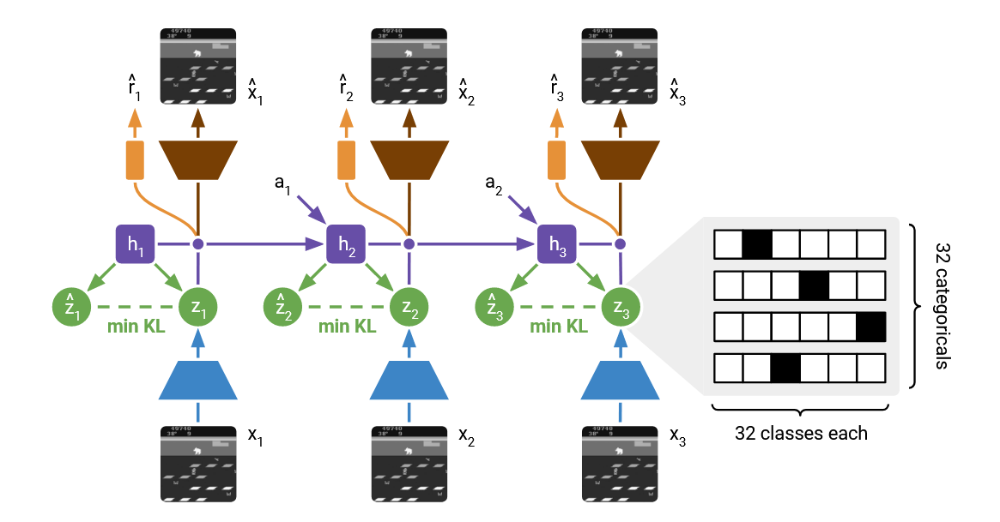
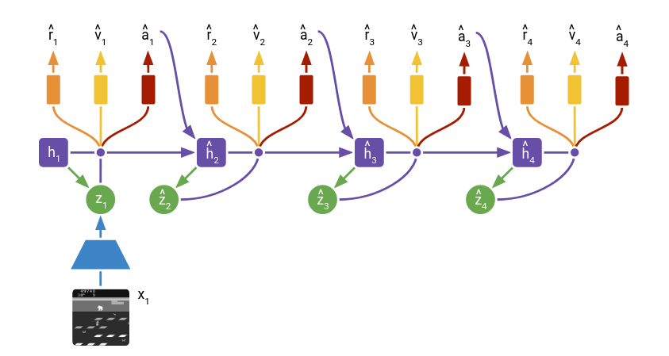

# DreamerV2

**Paper Link:** [**ICLR 2021 Conference**](https://openreview.net/pdf?id=0oabwyZbOu) or 
[**arXiv**](https://arxiv.org/pdf/2010.02193).

**DreamerV2** constitutes the first agent that achieves human-level performance on the Atari benchmark of 55 tasks 
by learning behaviors inside a separately trained world model.

This table lists some general features about **DreamerV2**:

| Features of DreamerV2 | Values | Description                                              |
|-----------------------|--------|----------------------------------------------------------|
| On-policy             | ❌      | The evaluate policy is the same as the target policy.    |
| Off-policy            | ✅      | The evaluate policy is different from the target policy. | 
| Model-free            | ❌      | No need to prepare an environment dynamics model.        | 
| Model-based           | ✅      | Need an environment model to train the policy.           | 
| Discrete Action       | ✅      | Focus on discrete action space mainly.                   |   
| Continuous Action     | ✅      | Focus on continuous action space mainly.                 |    


## World Model

### Introduction

Compared to **model-free** reinforcement learning, to successfully operate in unknown environments, reinforcement learning 
agents need to learn about their real environments over time. **World models** are an explicit way to represent an 
agent’s knowledge about its environment.
The **Dreamer series** employs a **latent dynamics model** —a design also adopted by several other world models—which 
constructs a mapping from high-dimensional real-world environmental information to a low-dimensional latent space.

By predicting compact latent representations rather than high-dimensional observations, the world model 
not only **reduce accumulating errors** but also enables the **construction of parallelized environments**, 
thereby improving both computational and sample efficiency.

Despite the compelling characteristics of world models, as of 2020, 
their accuracy remains insufficient to compete with state-of-the-art model-free algorithms.
However, **DreamerV2** marked a significant breakthrough: DreamerV2 is the first agent that learns purely within 
a world model to achieve human-level Atari performance, demonstrating the high accuracy of its learned world model.

Compared with **DreamerV1**, **DreamerV2** introduces several major improvements, among which two key advancements are highlighted here:

- *Categorical latents* — DreamerV2 replaces the Gaussian latent variables used in DreamerV1 with 
categorical latent variables optimized through straight-through gradients, leading to more expressive and stable latent dynamics modeling.

- *KL balancing* — Instead of employing the “free nats” technique, 
DreamerV2 applies KL balancing by separately scaling the prior cross-entropy and the posterior entropy 
within the KL divergence term, thereby encouraging a more accurate temporal prior and reducing posterior collapse.

### Dreamer Model Framework

Dreamer world model consists of an image encoder, a Recurrent State-Space Model(**RSSM**) to learn the dynamics, 
and predictors for the image, reward, and discount factor:



The core component of the DreamerV2 world model is the **Recurrent State-Space Model (RSSM)**, 
which can be regarded as a fusion of a **recurrent neural network variant (GRU)** and a **variational autoencoder (VAE)**.
The world model can thus be interpreted as a sequential VAE. 

So, the **loss function** of the world model corresponds to the **Evidence Lower Bound (ELBO)**, or equivalently, 
the variational free energy, of a **Hidden Markov Model (HMM)** that is conditioned on the sequence of actions taken by the agent:


$$
\mathcal{L}(\phi) := \mathbb{E}_{q_\phi(z_{1:T}\mid a_{1:T}, x_{1:T})} \Bigg[
\sum_{t=1}^T \Big(
\underbrace{-\ln p_\phi(x_t \mid h_t, z_t)}_{\text{image log loss}}+
\underbrace{-\ln p_\phi(r_t \mid h_t, z_t)}_{\text{reward log loss}}+
\underbrace{-\ln p_\phi(\gamma_t \mid h_t, z_t)}_{\text{discount log loss}}+
\underbrace{\beta D_{\mathrm{KL}}\big(q_\phi(z_t \mid h_t, x_t) \parallel p_\phi(z_t \mid h_t)\big)}_{\text{KL loss}}
\Big)
\Bigg]
$$


## Behavior Learning

The world model remains fixed during the behavioral learning process and serves to generate auxiliary training trajectories:



Therefore, classical model-free reinforcement learning algorithms (the original paper employs an **Actor-Critic** approach) 
can leverage trajectories generated by the world model to facilitate policy learning.


## Run DreamerV2 in XuanCe

Before running **DreamerV2** in XuanCe, you need to prepare a conda environment and install ``xuance`` following
the [**installation steps**](./../../usage/installation.rst#install-xuance).

### Run Build-in Demos

After completing the installation, you can open a Python console and run **DreamerV2** directly using the following commands:

```python3
import xuance
runner = xuance.get_runner(method='DreamerV2',
                           env='classic_control',  # Choices: classic_control, atari.
                           env_id='CartPole-v1',  # Choices: CartPole-v1, Pendulum-v1, ALE/Pong-v5.
                           is_test=False)
runner.run()  # Or runner.benchmark()
```

### Run With Self-defined Configs

If you want to run **DreamerV2** with different configurations, you can build a new ``.yaml`` file, e.g. ``my_config.yaml``.
Then, run the **DreamerV2** by the following code block:

```python3
import xuance
runner = xuance.get_runner(method='DreamerV2',
                           env='classic_control',  # Choices: classic_control, atari.
                           env_id='CartPole-v1',  # Choices: CartPole-v1, Pendulum-v1, ALE/Pong-v5.
                           config_path="my_config.yaml",  # The path of my_config.yaml file should be correct.
                           is_test=False)
runner.run()  # Or runner.benchmark()
```

To learn more about the configurations, please visit the 
[**tutorial of configs**](./../../api/configs/configuration_examples.rst).

### Run With Custom Environment

If you would like to run XuanCe's **DreamerV2** in your own environment that was not included in XuanCe, 
you need to define the new environment following the steps in 
[**New Environment Tutorial**](./../../usage/custom_env/custom_drl_env.rst).
Then, [**prepapre the configuration file**](./../../usage/custom_env/custom_drl_env.rst#step-2-create-the-config-file-and-read-the-configurations) 
``dreamerv2_myenv.yaml``.

After that, you can run **DreamerV2** in your own environment with the following code:

```python3
import argparse
from xuance.common import get_configs
from xuance.environment import REGISTRY_ENV
from xuance.environment import make_envs
from xuance.torch.agents import DreamerV2Agent

configs_dict = get_configs(file_dir="dreamerv2_myenv.yaml")
configs = argparse.Namespace(**configs_dict)
REGISTRY_ENV[configs.env_name] = MyNewEnv

envs = make_envs(configs)  # Make parallel environments.
Agent = DreamerV2Agent(config=configs, envs=envs)  # Create a dreamerv2 agent from XuanCe.
Agent.train(configs.running_steps // configs.parallels)  # Train the model for numerous steps.
Agent.save_model("final_train_model.pth")  # Save the model to model_dir.
Agent.finish()  # Finish the training.
```


## Citation

```{code-block} bash
@inproceedings{
hafner2021mastering,
title={Mastering Atari with Discrete World Models},
author={Danijar Hafner and Timothy P Lillicrap and Mohammad Norouzi and Jimmy Ba},
booktitle={International Conference on Learning Representations},
year={2021},
url={https://openreview.net/forum?id=0oabwyZbOu}
}
```

```{code-block} bash
@article{hafner2020mastering,
  title={Mastering atari with discrete world models},
  author={Hafner, Danijar and Lillicrap, Timothy and Norouzi, Mohammad and Ba, Jimmy},
  journal={arXiv preprint arXiv:2010.02193},
  year={2020}
}
```
