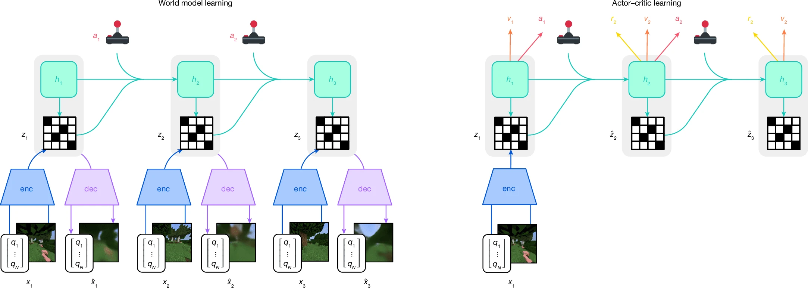
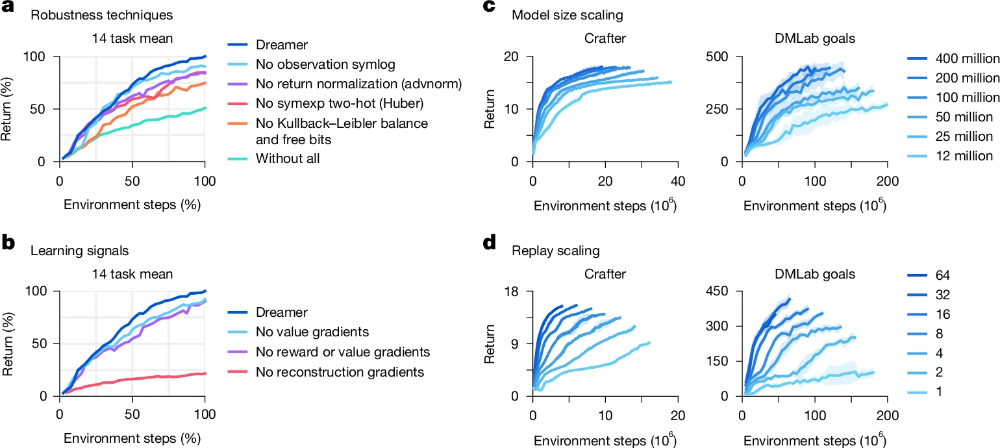

# DreamerV3

**Paper Link:** [**Nature**](https://www.nature.com/articles/s41586-025-08744-2).

Although current reinforcement-learning algorithms can be readily applied to tasks similar to what they have been developed for,
configuring them for new application domains requires substantial human expertise and experimentation. 
The third generation of Dreamer(**DreamerV3**), a general algorithm that outperforms specialized methods across over 150 diverse tasks, 
with a single configuration.
The primary improvement of DreamerV3 over V2 lies in its incorporation of a more efficient model architecture 
and more stable training strategies, enabling it to autonomously learn and collect targets (such as diamonds in **Minecraft**)
from scratch.Remarkably, DreamerV3 is the first algorithm to collect diamonds in Minecraft from scratch without 
relying on any human-generated data or curriculum (prior to the release of v3).

This table lists some general features about **DreamerV3**:

| Features of DreamerV3 | Values | Description                                              |
|-----------------------|--------|----------------------------------------------------------|
| On-policy             | ❌      | The evaluate policy is the same as the target policy.    |
| Off-policy            | ✅      | The evaluate policy is different from the target policy. | 
| Model-free            | ❌      | No need to prepare an environment dynamics model.        | 
| Model-based           | ✅      | Need an environment model to train the policy.           | 
| Discrete Action       | ✅      | Focus on discrete action space mainly.                   |   
| Continuous Action     | ✅      | Focus on continuous action space mainly.                 |    


## Introduction

Compared to DreamerV2, DreamerV3 does not introduce significant changes to the design of the world model or
the framework for the collaboration between the world model and policy learning:



- *The world model encodes sensory inputs $x_{t}$ using the encoder (enc) into discrete representations $z_{t}$ 
that are predicted by a sequence model with recurrent state $h_{t}$ given actions $a_{t}$. 
The inputs are reconstructed as $\hat{x}_{t}$ using the decoder (dec) to shape the representations.*

- *The actor and critic predict actions $a_{t}$ and values $v_{t}$ and learn from trajectories of 
abstract representations $\hat{z}_{t}$ and rewards $r_{t}$ predicted by the world model.*

V3 is primarily an extension of the robustness techniques and methods introduced in V2, such as the incorporation of 
**exponential moving averages(EMA)** to stabilize the Critic network, etc.
Additionally, it refines the **loss functions** for the training of the world model, critic, and actor, 
with the introduction of **multiple parameters** to enhance the compatibility of the entire network framework across various domains, 
thereby improving DreamerV3's adaptability to cross-domain tasks.

The ablation study results of these robustness techniques and robust scaling are as follows:




## Run DreamerV3 in XuanCe

Before running **DreamerV3** in XuanCe, you need to prepare a conda environment and install ``xuance`` following
the [**installation steps**](./../../usage/installation.rst#install-xuance).

### Run Build-in Demos

After completing the installation, you can open a Python console and run **DreamerV3** directly using the following commands:

```python3
import xuance
runner = xuance.get_runner(method='DreamerV3',
                           env='classic_control',  # Choices: classic_control, atari.
                           env_id='CartPole-v1',  # Choices: CartPole-v1, Pendulum-v1, ALE/Pong-v5.
                           is_test=False)
runner.run()  # Or runner.benchmark()
```

### Run With Self-defined Configs

If you want to run **DreamerV3** with different configurations, you can build a new ``.yaml`` file, e.g. ``my_config.yaml``.
Then, run the **DreamerV3** by the following code block:

```python3
import xuance
runner = xuance.get_runner(method='DreamerV3',
                           env='classic_control',  # Choices: classic_control, atari.
                           env_id='CartPole-v1',  # Choices: CartPole-v1, Pendulum-v1, ALE/Pong-v5.
                           config_path="my_config.yaml",  # The path of my_config.yaml file should be correct.
                           is_test=False)
runner.run()  # Or runner.benchmark()
```

To learn more about the configurations, please visit the 
[**tutorial of configs**](./../../api/configs/configuration_examples.rst).

### Run With Custom Environment

If you would like to run XuanCe's **DreamerV3** in your own environment that was not included in XuanCe, 
you need to define the new environment following the steps in 
[**New Environment Tutorial**](./../../usage/custom_env/custom_drl_env.rst).
Then, [**prepapre the configuration file**](./../../usage/custom_env/custom_drl_env.rst#step-2-create-the-config-file-and-read-the-configurations) 
``dreamerv3_myenv.yaml``.

After that, you can run **DreamerV3** in your own environment with the following code:

```python3
import argparse
from xuance.common import get_configs
from xuance.environment import REGISTRY_ENV
from xuance.environment import make_envs
from xuance.torch.agents import DreamerV3Agent

configs_dict = get_configs(file_dir="dreamerv3_myenv.yaml")
configs = argparse.Namespace(**configs_dict)
REGISTRY_ENV[configs.env_name] = MyNewEnv

envs = make_envs(configs)  # Make parallel environments.
Agent = DreamerV3Agent(config=configs, envs=envs)  # Create a dreamerv3 agent from XuanCe.
Agent.train(configs.running_steps // configs.parallels)  # Train the model for numerous steps.
Agent.save_model("final_train_model.pth")  # Save the model to model_dir.
Agent.finish()  # Finish the training.
```


## Citation

```{code-block} bash
@article{hafner2025mastering,
  title={Mastering diverse control tasks through world models},
  author={Hafner, Danijar and Pasukonis, Jurgis and Ba, Jimmy and Lillicrap, Timothy},
  journal={Nature},
  pages={1--7},
  year={2025},
  publisher={Nature Publishing Group UK London}
}
```
