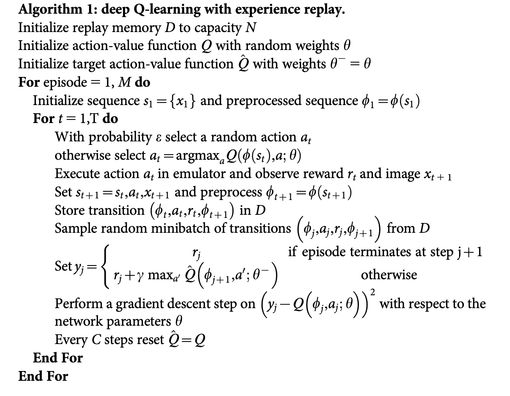

# Deep Q-Network (DQN)

Deep Q-Network (DQN) is a foundational algorithm in DRL that integrates Q-learning,
a popular reinforcement learning method, with deep neural networks.
It was first introduced by a team at DeepMind in 2015 
and demonstrated remarkable success in playing Atari games directly from pixel inputs, 
achieving superhuman performance in many cases.

DQN is a **off-policy**, **model-free** algorithm, it deals with **discrete action space**.

Paper Link: [https://www.nature.com/articles/nature14236](https://www.nature.com/articles/nature14236).

## Q-Learning

[**Q-Learning**](https://link.springer.com/article/10.1007/bf00992698) 
is a model-free RL algorithm where the agent learns a Q-value function $Q(s, a)$, 
which estimates the expected cumulative reward of taking an action $a$ in a state $s$ and following the optimal policy thereafter. 

The [**Bellman equation**](https://en.wikipedia.org/wiki/Bellman_equation) updates the Q-value:

$$
Q(s, a) \leftarrow Q(s, a) + \alpha [ r + \gamma \max_{a'}Q(s', a') - Q(s, a) ].
$$

Here, $\alpha$ is the learning rate, $r$ is the reward, $\gamma$ is the discount factor, and $s'$ is the next state.

## Deep Q-Netowrk

Instead of storing the Q-values in a table 
([**tabular Q-learning**](https://en.wikipedia.org/wiki/Q-learning#/media/File:Q-Learning_Matrix_Initialized_and_After_Training.png)), 
DQN uses a deep neural network to approximate the Q-function, enabling it to handle high-dimensional state spaces like images.

A buffer stores the agent's experiences $<s, a, r, s'>$, and mini-batches of experiences are sampled randomly to train the network. 
This reduces correlation between consecutive samples and stabilizes training.

A separate target network is used to compute the Q-value targets during training. 
The target network is updated periodically to reduce oscillations and instability.

The network is trained using the 
[**mean-squared error (MSE)**](https://en.wikipedia.org/wiki/Mean_squared_error) 
loss between the predicted Q-value and the target:

$$
L = \mathbb{E}_{(s, a, s', r) \sim \mathcal{D}}[(y - Q(s, a; \theta))^2],
$$

where $y = r + \gamma \max_{a'}{Q(s', a'; \theta^{-})}$, and $\theta^{-}$ is the parameters of the target network.

DQN uses an $\epsilon -greedy$ policy to explores random actions 
with probability $\epsilon$ and exploits the learned policy otherwise:

$$
\pi(s) = 
\begin{cases}
\arg\max_{a}Q(s, a) & \text{with probability } 1-\epsilon, \\
\text{a random action} & \text{with probability } \epsilon.
\end{cases}
$$

Strengths of DQN:
- Handles high-dimensional input spaces like images.
- Stabilizes Q-learning through techniques like experience replay and target networks.
- Demonstrated capability to outperform humans in several Atari games.

## Algorithm

The full algorithm for training DQN is presented in Algorithm 1:



## Run DQN in XuanCe

Before running DQN in XuanCe, you need to prepare a conda environment and install ``xuance`` following 
the [**installation steps**](https://xuance.readthedocs.io/en/latest/documents/usage/installation.html).

### Run Build-in Demos

After completing the installation, you can open a Python console and run DQN directly using the following commands:

```python3
import xuance
runner = xuance.get_runner(method='dqn',
                           env='classic_control',  # Choices: claasi_control, box2d, atari.
                           env_id='CartPole-v1',  # Choices: CartPole-v1, LunarLander-v2, ALE/Breakout-v5, etc.
                           is_test=False)
runner.run()  # Or runner.benchmark()
```

### Run With Self-defined Configs

If you want to run DQN with different configurations, you can build a new ``.yaml`` file, e.g., ``my_config.yaml``.
Then, run the DQN by the following code block:

```python3
import xuance as xp
runner = xp.get_runner(method='dqn',
                       env='classic_control',  # Choices: claasi_control, box2d, atari.
                       env_id='CartPole-v1',  # Choices: CartPole-v1, LunarLander-v2, ALE/Breakout-v5, etc.
                       config_path="my_config.yaml",  # The path of my_config.yaml file should be correct.
                       is_test=False)
runner.run()  # Or runner.benchmark()
```

To learn more about the configurations, please visit the 
[**tutorial of configs**](https://xuance.readthedocs.io/en/latest/documents/api/configs/configuration_examples.html).

### Run With Customized Environment

If you would like to run XuanCe's DQN in your own environment that was not included in XuanCe, 
you need to define the environment following the steps in 
[**New Environment Tutorial**](https://xuance.readthedocs.io/en/latest/documents/usage/new_envs.html#step-1-create-a-new-environment).
Then, [**prepapre the configuration file**](https://xuance.readthedocs.io/en/latest/documents/usage/new_envs.html#step-2-create-the-config-file-and-read-the-configurations) 
``dqn_myenv.yaml``.

After that, you can run DQN in your own environment with the following code:

```python3
import argparse
from xuance.common import get_configs
from xuance.environment import REGISTRY_ENV
from xuance.environment import make_envs
from xuance.torch.agents import DQN_Agent

configs_dict = get_configs(file_dir="dqn_myenv.yaml")
configs = argparse.Namespace(**configs_dict)
REGISTRY_ENV[configs.env_name] = MyNewEnv

envs = make_envs(configs)  # Make parallel environments.
Agent = DDPG_Agent(config=configs, envs=envs)  # Create a DDPG agent from XuanCe.
Agent.train(configs.running_steps // configs.parallels)  # Train the model for numerous steps.
Agent.save_model("final_train_model.pth")  # Save the model to model_dir.
Agent.finish()  # Finish the training.
```

## Citation

```{code-block} bash
@article{mnih2015human,
  title={Human-level control through deep reinforcement learning},
  author={Mnih, Volodymyr and Kavukcuoglu, Koray and Silver, David and Rusu, Andrei A and Veness, Joel and Bellemare, Marc G and Graves, Alex and Riedmiller, Martin and Fidjeland, Andreas K and Ostrovski, Georg and others},
  journal={nature},
  volume={518},
  number={7540},
  pages={529--533},
  year={2015},
  publisher={Nature Publishing Group UK London}
}
```

## APIs

### PyTorch

```{eval-rst}
.. automodule:: xuance.torch.agents.qlearning_family.dqn_agent
    :members:
    :undoc-members:
    :show-inheritance:
```

### TensorFlow2

```{eval-rst}
.. automodule:: xuance.tensorflow.agents.qlearning_family.dqn_agent
    :members:
    :undoc-members:
    :show-inheritance:
```

### MindSpore

```{eval-rst}
.. automodule:: xuance.mindspore.agents.qlearning_family.dqn_agent
    :members:
    :undoc-members:
    :show-inheritance:
```
