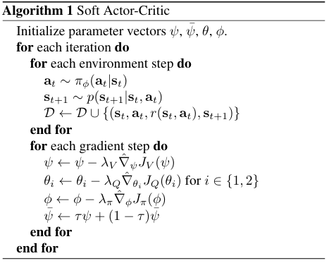

# Soft Actor-Critic (SAC)
**Paper link:[arxiv](https://arxiv.org/abs/1802.09477)**.

Soft Actor-Critic (SAC) is a state-of-the-art model-free deep reinforcement learning algorithm that combines the actor-critic framework with the principles of maximum entropy reinforcement learning. Introduced in 2018, it has gained significant attention for its effectiveness in handling continuous action spaces and its robust performance across various complex tasks.

This table lists some general features about SAC algorithm:
| Features of Double DQN  | Values | Description                                              |
|-------------------------|--------|----------------------------------------------------------|
| On-policy               | ❌      | The evaluate policy is the same as the target policy.    |
| Off-policy              | ✅      | The evaluate policy is different from the target policy. |
| Model-free              | ✅      | No need to prepare an environment dynamics model.        |
| Model-based             | ❌      | Need an environment model to train the policy.           |
| Discrete Action         | ✅      | Deal with discrete action space.                         |
| Continuous Action       | ✅      | Deal with continuous action space.                       |

## Key Ideas of SAC
**Objective Setting Based on Maximum Entropy:**
Traditional reinforcement learning aims to maximize the sum of expected rewards. In contrast, the maximum entropy reinforcement learning objective adopted by SAC is
$$
J(\pi) = \sum_{t=0}^{T} \mathbb{E}_{(s_t, a_t) \sim \rho_{\pi}} \left[ r(s_t, a_t) + \alpha \mathcal{H}(\pi(\cdot | s_t)) \right]
$$
where:
+ $\mathcal{H}(π(⋅|s_t))$ represents the entropy of policy π in state st.
+ $α$ is a hyperparameter that controls the importance of entropy.
+ 
This objective introduces an $\alpha\mathcal{H}(π(⋅|s_t))$ entropy term , encouraging the agent to maintain a certain degree of randomness while pursuing rewards, thereby enhancing the exploration ability. The temperature parameter $\alpha$ determines the relative importance of the entropy term and the reward, controlling the degree of randomness of the optimal policy. When , the traditional maximum expected reward objective can be recovered. This objective setting enables the agent to explore multiple behavior patterns and find better strategies in complex environments.

**Twin Q-Network Design:**
To reduce the overestimation of Q-values, SAC uses two critic networks. Each critic network independently estimates the value of state-action pairs, and the minimum of the two Q-values is used to calculate the target Q-value. This design effectively reduces the bias in Q-value estimation and improves the stability of the algorithm.

**Soft Update Mechanism:**
SAC uses a soft update mechanism to update the target network, improving the stability of training. Specifically, the parameters of the target network are updated as follows:
$\theta_{\text{target}} \leftarrow \tau \theta + (1 - \tau) \theta_{\text{target}}$
where τ is a small positive number, typically taken to be 0.005. This soft update mechanism smooths the parameter updates of the target network, preventing drastic changes in the target network parameters.

## Algorithm
The full algorithm for training TD3 is presented in Algorithm 1:
  
**Supplement:** TD3 and SAC share similarities in multiple aspects, including network architecture, the design of dual Q-networks, soft update mechanisms, training stability, applicable scenarios, implementation characteristics, optimization objectives, and practical value. These similarities enable both of them to perform remarkably well when handling tasks in continuous action spaces. However, they differ in exploration mechanisms and policy types, which determines their applicability and performance in different tasks.  
Check out the [TD3](./td3_agent.md)   algorithm.

## Run SAC in XuanCe
Before running SAC in XuanCe, you need to prepare a conda environment and install ```xuance``` following the
 [**installation steps**](./../../../usage/installation.rst#install-xuance).
### Run Build-in Demos
After completing the installation, you can open a Python console and run TD3 directly using the following commands:
```
import xuance
runner = xuance.get_runner(method='SAC',
                           env='classic_control',  # Choices: claasi_control, box2d, atari.
                           env_id='Pendulum-v1', 
                           is_test=False)
runner.run()  # Or runner.benchmark()
```
### Run With Self-defined Configs
If you want to run SAC with different configurations, you can build a new ```.yaml``` file, e.g., 
```my_config.yaml```. Then, run the SAC by the following code block:
```
import xuance as xp
runner = xp.get_runner(method='SAC',
                       env='classic_control',  # Choices: claasi_control, box2d, .
                       env_id='Pendulum-v1',  
                       config_path="my_config.yaml",  # The path of my_config.yaml file should be correct.
                       is_test=False)
runner.run()  # Or runner.benchmark()
```
To learn more about the configurations, please visit the
 [**tutorial of configs**](./../../configs/configuration_examples.rst).
### Run With Customized Environment
If you would like to run XuanCe’s SAC in your own environment that was not included in XuanCe, you need to 
define the new environment following the steps in 
 [**New Environment Tutorial**](./../../../usage/new_envs.rst).
Then, [**prepapre the configuration file**](./../../../usage/new_envs.rst#step-2-create-the-config-file-and-read-the-configurations) 
   ```SAC_myenv.yaml```.

After that, you can run SAC in your own environment with the following code:
```
import argparse
from xuance.common import get_configs
from xuance.environment import REGISTRY_ENV
from xuance.environment import make_envs
from xuance.torch.agents import SAC_Agent

configs_dict = get_configs(file_dir="SAC_myenv.yaml")
configs = argparse.Namespace(**configs_dict)
REGISTRY_ENV[configs.env_name] = MyNewEnv

envs = make_envs(configs)  # Make parallel environments.
Agent = SAC_Agent(config=configs, envs=envs)  # Create a SAC agent from XuanCe.
Agent.train(configs.running_steps // configs.parallels)  # Train the model for numerous steps.
Agent.save_model("final_train_model.pth")  # Save the model to model_dir.
Agent.finish()  # Finish the training.

## Citation
```
@inproceedings{haarnoja2018soft,
  title={Soft actor-critic: Off-policy maximum entropy deep reinforcement learning with a stochastic actor},
  author={Haarnoja, Tuomas and Zhou, Aurick and Abbeel, Pieter and Levine, Sergey},
  booktitle={International conference on machine learning},
  pages={1861--1870},
  year={2018},
  organization={PMLR}
}
```

## APIs
## PyTorch
```{eval-rst}
.. automodule:: xuance.torch.agents.policy_gradient.sac_agent
    :members:
    :undoc-members:
    :show-inheritance:
```
## TensorFlow2
```{eval-rst}
.. automodule:: xuance.tensorflow.agents.policy_gradient.sac_agent
    :members:
    :undoc-members:
    :show-inheritance:
```
## MindSpore
```{eval-rst}
.. automodule:: xuance.mindspore.agents.policy_gradient.sac_agent
    :members:
    :undoc-members:
    :show-inheritance:
```

