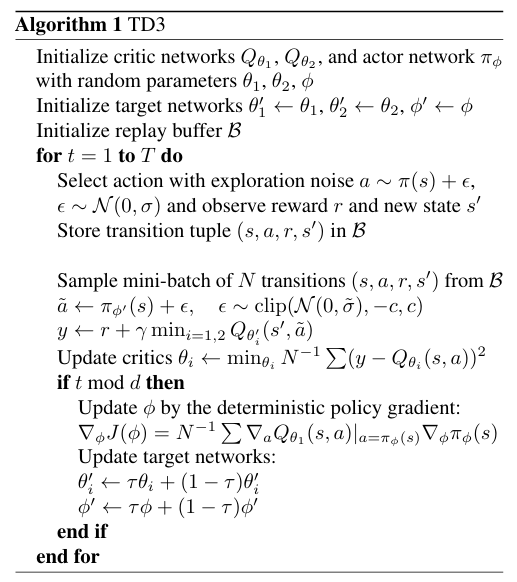

# Twin Delayed Deep Deterministic policy gradient algorithm (TD3)
**Paper link:[arxiv](https://arxiv.org/abs/1802.09477)**

Twin Delayed Deep Deterministic policy gradient algorithm (TD3) is an enhancement of the Deep Deterministic Policy Gradient (DDPG) algorithm, designed to address the issue of overestimation  in continuous control domains.TD3 introduces three key improvements to address some issues in DDPG: Double Critic Networks (Clipped Double-Q Learning), Delayed Policy Updates, arget Policy Smoothing. 

This table lists some general features about TD3 algorithm:

| Features of Double DQN  | Values | Description                                              |
|-------------------------|--------|----------------------------------------------------------|
| On-policy               | ❌      | The evaluate policy is the same as the target policy.    |
| Off-policy              | ✅      | The evaluate policy is different from the target policy. |
| Model-free              | ✅      | No need to prepare an environment dynamics model.        |
| Model-based             | ❌      | Need an environment model to train the policy.           |
| Discrete Action         | ❌      | Deal with discrete action space.                         |
| Continuous Action       | ✅      | Deal with continuous action space.                       |

## The Risk of Overestimating
 This overestimation property is also present for deterministic policy gradients. Due to the slow change of the policy in the actor - critic setting, the current and target value estimates remain too similar to avoid the maximization bias. Therefore, Double DQN (Van Hasselt et al., 2016) doesn't work.
 
## Key Ideas of TD3
**Clipped Double Q - learning:**
 A pair of critics ( and ) are employed to reduce the overestimation bias. When calculating the target value , 
 the minimum of the two critics' estimates is taken, that is 
 $
 y = r + \gamma \min_{i=1,2} Q_{\theta_i'}(s', \pi_{\phi'}(s')) + \epsilon
 $
 where $\epsilon \sim \text{clip}(\mathcal{N}(0, \sigma), -c, c)$. This way, the value target does not introduce
 more overestimation than the standard Q - learning target and tends to underestimate. Since the underestimated 
 action values are not explicitly propagated in the policy update, the negative impacts are reduced.  
**Delayed Policy Updates:** Recognizing the importance of target networks in reducing error
 accumulation and the negative effects of high variance estimates on policy updates, the TD3 algorithm delays 
 policy updates. The policy and target networks are only updated after the critic has been updated a fixed 
 number of times d. Also, the target networks are updated slowly 
 $\theta_i' \leftarrow \tau \theta_i + (1 - \tau) \theta_i'$.  
**Target Policy Smoothing Regularization:** To address the problem that deterministic policies may overfit to 
narrow peaks in the value estimate, target policy smoothing regularization is introduced. When updating 
the critic, the training process is modified by adding small random noise to the target policy and averaging 
over mini - batches,
$$
y = r + \gamma Q_{\theta'}(s', \pi_{\phi'}(s') + \epsilon),
\epsilon \sim \text{clip}(\mathcal{N}(0, \sigma), -c, c)
$$ 
so that similar actions have similar values. This reduces the variance of the target and improves the performance 
in stochastic domains and in the presence of failure cases.  
**Ablation Studies**：Authors perform ablation studies to understand the contribution of each individual component
(Clipped Double Q - learning,Delayed Policy Updates,Target Policy Smoothing Regularization):
While the addition of only a single component causes insignificant improvement in most cases, the addition of 
combinations performs at a much higher level.

## Algorithm
The full algorithm for training TD3 is presented in Algorithm 1:


## Run TD3 in XuanCe
Before running TD3 in XuanCe, you need to prepare a conda environment and install ```xuance``` following the  
 [**installation steps**](./../../../usage/installation.rst#install-xuance).
### Run Build-in Demos
After completing the installation, you can open a Python console and run TD3 directly using the following commands:
```
import xuance
runner = xuance.get_runner(method='td3',
                           env='classic_control',  # Choices: claasi_control, box2d, atari.
                           env_id='Pendulum-v1',  # Choices: CartPole-v1, LunarLander-v2, ALE/Breakout-v5, etc.
                           is_test=False)
runner.run()  # Or runner.benchmark()
```
### Run With Self-defined Configs
If you want to run TD3 with different configurations, you can build a new ```.yaml``` file, e.g., 
```my_config.yaml```. Then, run the TD3 by the following code block:
```
import xuance as xp
runner = xp.get_runner(method='td3',
                       env='classic_control',  # Choices: claasi_control, box2d, .
                       env_id='Pendulum-v1',  
                       config_path="my_config.yaml",  # The path of my_config.yaml file should be correct.
                       is_test=False)
runner.run()  # Or runner.benchmark()
```
To learn more about the configurations, please visit the
 [**tutorial of configs**](./../../configs/configuration_examples.rst).
### Run With Customized Environment
If you would like to run XuanCe’s TD3 in your own environment that was not included in XuanCe, you need to 
define the new environment following the steps in 
 [**New Environment Tutorial**](./../../../usage/new_envs.rst).
Then, [**prepapre the configuration file**](./../../../usage/new_envs.rst#step-2-create-the-config-file-and-read-the-configurations) 
   ```td3_myenv.yaml```.

After that, you can run TD3 in your own environment with the following code:
```
import argparse
from xuance.common import get_configs
from xuance.environment import REGISTRY_ENV
from xuance.environment import make_envs
from xuance.torch.agents import TD3_Agent

configs_dict = get_configs(file_dir="td3_myenv.yaml")
configs = argparse.Namespace(**configs_dict)
REGISTRY_ENV[configs.env_name] = MyNewEnv

envs = make_envs(configs)  # Make parallel environments.
Agent = TD3_Agent(config=configs, envs=envs)  # Create a TD3 agent from XuanCe.
Agent.train(configs.running_steps // configs.parallels)  # Train the model for numerous steps.
Agent.save_model("final_train_model.pth")  # Save the model to model_dir.
Agent.finish()  # Finish the training.
```
### Citation
```
@inproceedings{fujimoto2018addressing,
  title={Addressing function approximation error in actor-critic methods},
  author={Fujimoto, Scott and Hoof, Herke and Meger, David},
  booktitle={International conference on machine learning},
  pages={1587--1596},
  year={2018},
  organization={PMLR}
}
```


## APIs

### PyTorch
```{eval-rst}
.. automodule:: xuance.torch.agents.policy_gradient.td3_agent
    :members:
    :undoc-members:
    :show-inheritance:
```
### TensorFlow2

```{eval-rst}
.. automodule:: xuance.tensorflow.agents.policy_gradient.td3_agent
    :members:
    :undoc-members:
    :show-inheritance:
```
### MindSpore
```{eval-rst}
.. automodule:: xuance.mindspore.agents.policy_gradient.td3_agent
    :members:
    :undoc-members:
    :show-inheritance:
```