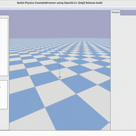

Drones
^^^^^^^^^^^^^^^

.. image:: ../../../../_static/figures/drones/helix.gif
    :height: 150px

.. image:: ../../../../_static/figures/drones/marl.gif
    :height: 150px

This environment is forked from the gym-pybullet-drones,
which is a gym environment with pybullet physics for reinforcement learning of multi-agent quadcopter control.
It supports both single and multiple drones control.
According to the official repository, it provides the following five kinds of action types:

- rpm: rounds per minutes (RPMs);
- pid: PID control;
- vel: Velocity input (using PID control);
- one_d_rpm: 1D (identical input to all motors) with RPMs;
- one_d_pid: 1D (identical input to all motors) with PID control.

You also have permission to customize the scenarios and tasks in this environment for your needs.

| **Official Address**: `https://github.com/utiasDSL/gym-pybullet-drones.git <https://github.com/utiasDSL/gym-pybullet-drones.git>`_
| **Paper**: `https://arxiv.org/pdf/2103.02142.pdf <https://arxiv.org/pdf/2103.02142.pdf>`_

Installation
''''''''''''''''''''''

.. tip::

    Before preparing the software packages for this simulator, it is recommended to create a new conda environment with **Python 3.10**.

Open terminal and type the following commands, then a new conda environment for xuance with drones could be built:

.. code-block:: bash

    conda create -n xuance_drones python=3.10
    conda activate xuance_drones
    pip install xuance  # refer to the installation of XuanCe.

    git clone https://github.com/utiasDSL/gym-pybullet-drones.git
    cd gym-pybullet-drones/
    pip install --upgrade pip
    pip install -e .  # if needed, `sudo apt install build-essential` to install `gcc` and build `pybullet`

During the installation of gym-pybullet-drones, you might encounter the errors like:

.. error::

    | gym-pybullet-drones 2.0.0 requires numpy<2.0,>1.24, but you have numpy 1.22.4 which is incompatible.
    | gym-pybullet-drones 2.0.0 requires scipy<2.0,>1.10, but you have scipy 1.7.3 which is incompatible.

**Solution**: Upgrade the above incompatible packages.

.. code-block:: bash

    pip install numpy==1.24.0
    pip install scipy==1.12.0

Try An Example
'''''''''''''''''''''''

Create a python file named, e.g., "demo_drones.py".

.. code-block:: python

    import argparse
    from xuance import get_runner

    def parse_args():
        parser = argparse.ArgumentParser("Run a demo.")
        parser.add_argument("--method", type=str, default="iddpg")
        parser.add_argument("--env", type=str, default="drones")
        parser.add_argument("--env-id", type=str, default="MultiHoverAviary")
        parser.add_argument("--test", type=int, default=0)
        parser.add_argument("--device", type=str, default="cuda:0")
        parser.add_argument("--parallels", type=int, default=10)
        parser.add_argument("--benchmark", type=int, default=1)
        parser.add_argument("--test-episode", type=int, default=5)

        return parser.parse_args()

    if __name__ == '__main__':
        parser = parse_args()
        runner = get_runner(method=parser.method,
                            env=parser.env,
                            env_id=parser.env_id,
                            parser_args=parser,
                            is_test=parser.test)
        if parser.benchmark:
            runner.benchmark()
        else:
            runner.run()

Open the terminal and type the python command:

.. code-block:: bash

    python demo_drones.py

| Then, you can brew a cup of coffee, and wait for the training process to finish.
| Finally, test the trained model and view the effectiveness.

.. code-block:: bash

    python demo_drones.py --benchmark 0 --test 1

.. raw:: html

      

APIs
'''''''''''''''''''

.. automodule:: xuance.environment.multi_agent_env.drones
    :members:
    :undoc-members:
    :show-inheritance:
