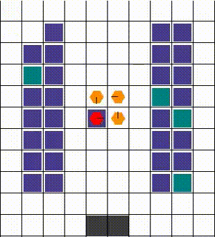
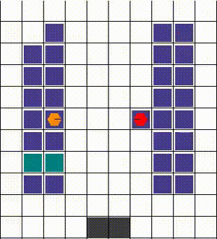

Robotic Warehouse
^^^^^^^^^^^^^^^^^^^^^^^^

The Robotic Warehouse is an MARL environment often used to simulate warehouse automation scenarios.
It serves as a testbed for studying cooperative, competitive, and mixed interaction among multiple agents, such as robots.
The environment is designed to model tasks commonly found in real-world warehouses,
such as navigation, item retrieval, obstacle avoidance, and task allocation.

.. image:: ../../../../_static/figures/rware/rware.gif
    :height: 150px
.. image:: ../../../../_static/figures/rware/collision1.gif
    :height: 150px

Official link: `https://github.com/semitable/robotic-warehouse.git <https://github.com/semitable/robotic-warehouse.git>`_.

Installation
''''''''''''''''

Method 1: Install from PyPI:

.. code-block:: bash

    pip install rware

Method 2: Install from GitHub repository:

.. code-block:: bash

    git clone git@github.com:uoe-agents/robotic-warehouse.git
    cd robotic-warehouse
    pip install -e .

To learn more about installation, see the `official tutorialofficial tutorial <https://github.com/semitable/robotic-warehouse?tab=readme-ov-file#installation>`_.

APIs
''''''''''''''

.. automodule:: xuance.environment.multi_agent_env.robotic_warehouse
    :members:
    :undoc-members:
    :show-inheritance:

