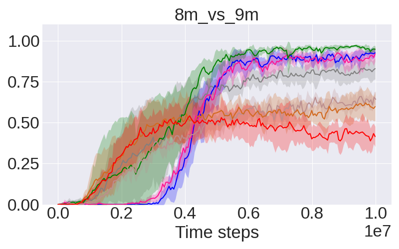

SMAC benchmarks
==========================

Scenarios
--------------------------

.. image:: ../../_static/figures/smac/smac.png
    :height: 150px

The evaulated maps are listed as follows:

+----------------+------------+----+-----+--------+------+-----+------------+------------+------+
| **Map**        | 2m_vs_1z   | 3m | 8m  | 1c3s5z | 2s3z | 25m | 5m_vs_6m   | 8m_vs_9m   | MMM2 |
+----------------+------------+----+-----+--------+------+-----+------------+------------+------+
| n_agents       | 2          | 3  | 8   | 9      | 5    | 25  | 5          | 8          | 10   |
+----------------+------------+----+-----+--------+------+-----+------------+------------+------+
| n_enemies      | 1          | 3  | 8   | 9      | 5    | 25  | 6          | 9          | 12   |
+----------------+------------+----+-----+--------+------+-----+------------+------------+------+
| episode_steps  | 150        | 60 | 120 | 180    | 120  | 150 | 70         | 120        | 180  |
+----------------+------------+----+-----+--------+------+-----+------------+------------+------+
| training_steps | 1M         | 1M | 1M  | 2M     | 2M   | 5M  | 10M        | 10M        | 10M  |
+----------------+------------+----+-----+--------+------+-----+------------+------------+------+

Unit Composition
--------------------------

The unit types and quantities for each map are listed as follows:

+----------------+----------------------------+----------------------------+
| **Map**        | **Ally Units**             | **Enemy Units**            |
+================+============================+============================+
| 2m_vs_1z       | 2 Marines                  | 1 Zergling                 |
+----------------+----------------------------+----------------------------+
| 3m             | 3 Marines                  | 3 Marines                  |
+----------------+----------------------------+----------------------------+
| 8m             | 8 Marines                  | 8 Marines                  |
+----------------+----------------------------+----------------------------+
| 1c3s5z         | 1 Colossus, 3 Stalkers,    | 1 Colossus, 3 Stalkers,    |
|                | 5 Zealots                  | 5 Zealots                  |
+----------------+----------------------------+----------------------------+
| 2s3z           | 2 Stalkers, 3 Zealots      | 2 Stalkers, 3 Zealots      |
+----------------+----------------------------+----------------------------+
| 25m            | 25 Marines                 | 25 Marines                 |
+----------------+----------------------------+----------------------------+
| 5m_vs_6m       | 5 Marines                  | 6 Marines                  |
+----------------+----------------------------+----------------------------+
| 8m_vs_9m       | 8 Marines                  | 9 Marines                  |
+----------------+----------------------------+----------------------------+
| MMM2           | 1 Medivac, 2 Marauders,    | 1 Medivac, 3 Marauders,    |
|                | 7 Marines                  | 8 Marines                  |
+----------------+----------------------------+----------------------------+

    
Results
--------------------------

.. image:: smac/fig_0_2m_vs_1z.png
    :height: 130px
.. image:: smac/fig_1_3m.png
    :height: 130px
.. image:: smac/fig_2_8m.png
    :height: 130px
.. image:: smac/fig_3_1c3s5z.png
    :height: 130px
.. image:: smac/fig_4_2s3z.png
    :height: 130px
.. image:: smac/fig_5_25m.png
    :height: 130px
.. image:: smac/fig_6_5m_vs_6m.png
    :height: 130px

.. image:: smac/fig_8_MMM2.png
    :height: 130px
