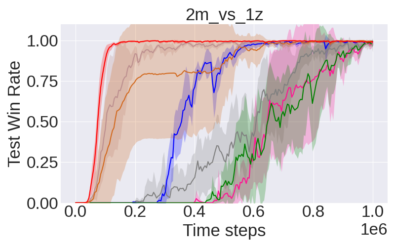
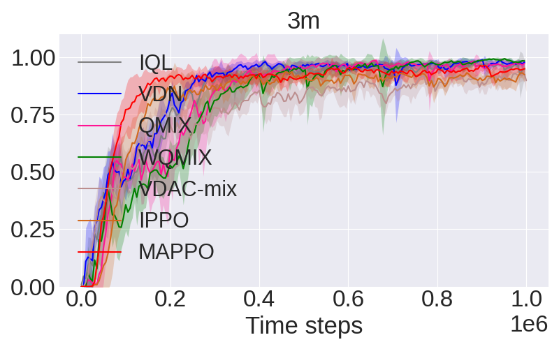
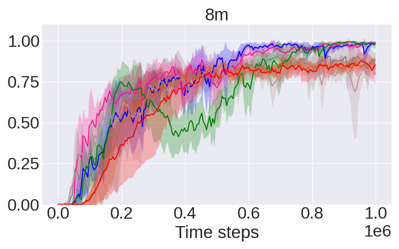
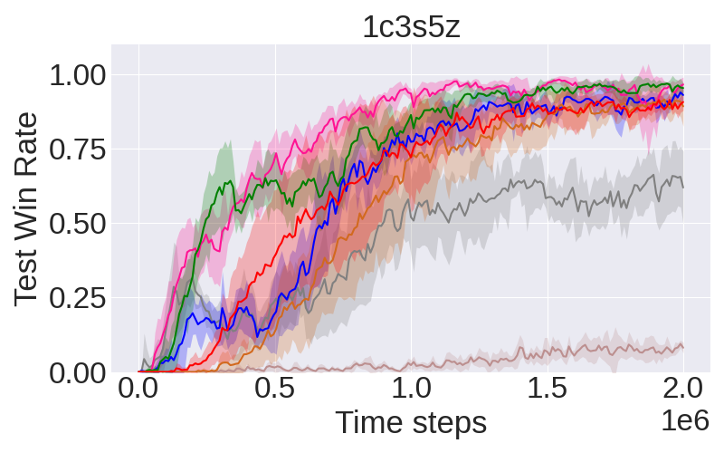
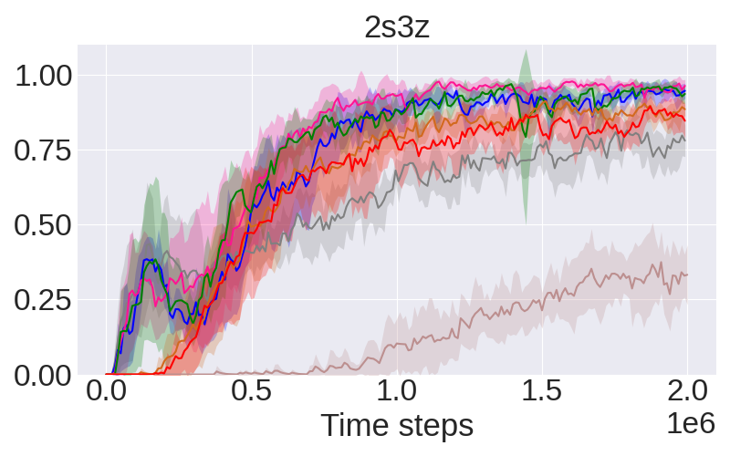
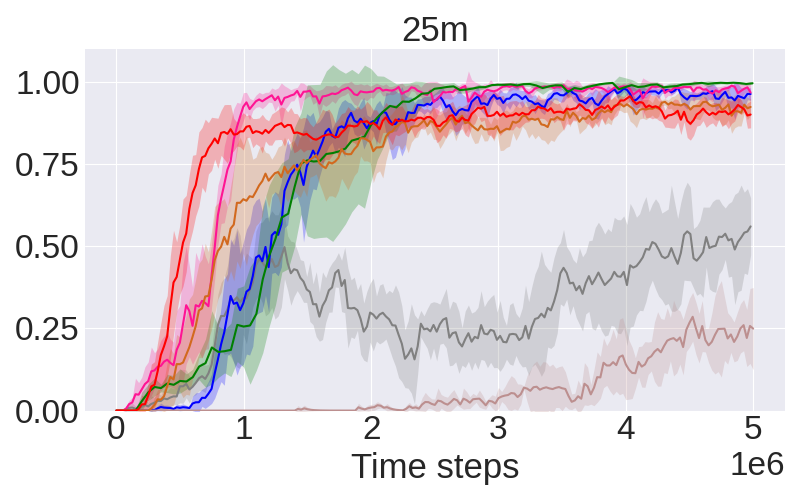
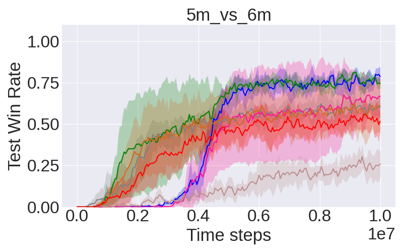
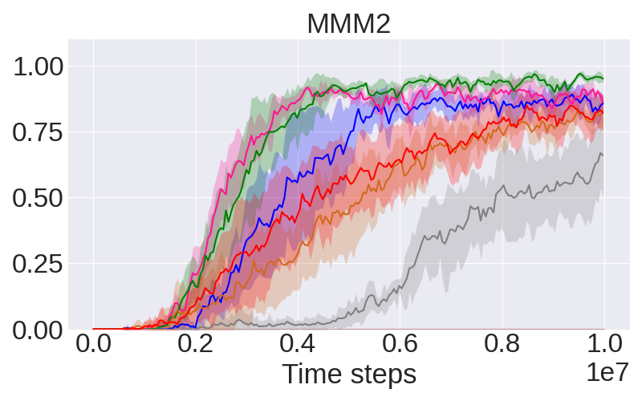

SMAC benchmarks
==========================

Scenarios
--------------------------

.. image:: ../../figures/smac/smac.png
    :height: 150px

The evaulated maps are listed as follows:

+----------------+------------+----+-----+--------+------+-----+------------+------------+------+
| **Map**        | 2m_vs_1z   | 3m | 8m  | 1c3s5z | 2s3z | 25m | 5m_vs_6m   | 8m_vs_9m   | MMM2 |
+----------------+------------+----+-----+--------+------+-----+------------+------------+------+
| n_agents       | 2          | 3  | 8   | 9      | 5    | 25  | 5          | 8          | 10   |
+----------------+------------+----+-----+--------+------+-----+------------+------------+------+
| n_enemies      | 1          | 3  | 8   | 9      | 5    | 25  | 6          | 9          | 12   |
+----------------+------------+----+-----+--------+------+-----+------------+------------+------+
| episode_steps  | 150        | 60 | 120 | 180    | 120  | 150 | 70         | 120        | 180  |
+----------------+------------+----+-----+--------+------+-----+------------+------------+------+
| training_steps | 1M         | 1M | 1M  | 2M     | 2M   | 5M  | 10M        | 10M        | 10M  |
+----------------+------------+----+-----+--------+------+-----+------------+------------+------+

    
Results
--------------------------

.. image:: smac/fig_7_8m_vs_9m.png
    :height: 130px

