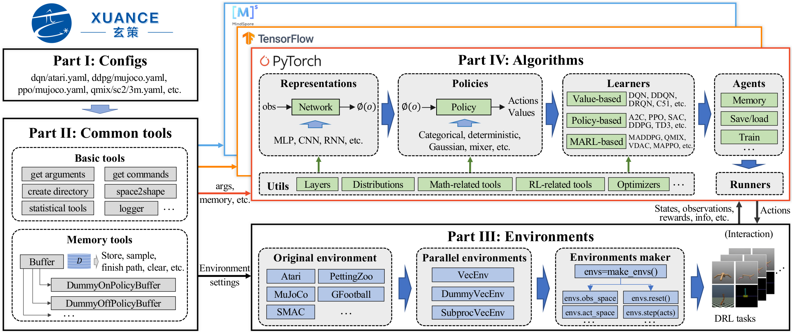

.. XuanCe documentation master file, created by
   sphinx-quickstart on Wed May 31 20:18:19 2023.
   You can adapt this file completely to your liking, but it should at least
   contain the root `toctree` directive.

Welcome to XuanCe's Documentation!
======================================

.. .. image:: /_static/figures/logo_1.png
   :scale: 30%
   :align: center
   :target: https://github.com/agi-brain/xuance.git

**XuanCe** is an open-source ensemble of Deep Reinforcement Learning (DRL) algorithm implementations.

We call it as **Xuan-Ce (玄策)** in Chinese.

| **Xuan (玄)** means incredible, mysterious, and black box in Chinese.
| **Ce (策)** means policy in Chinese.

DRL algorithms are sensitive to hyper-parameters tuning, varying in performance with different tricks,
and suffering from unstable training processes, therefore, sometimes DRL algorithms seems elusive and "Xuan".
This project gives a thorough, high-quality and easy-to-understand implementation of DRL algorithms,
and hope this implementation can give a hint on the magics of reinforcement learning.

We expect it to be compatible with multiple deep learning toolboxes:

PyTorch_, TensorFlow_, and MindSpore_,

and hope it can really become a zoo full of DRL algorithms.

.. _PyTorch: https://pytorch.org/
.. _TensorFlow: https://www.tensorflow.org/
.. _MindSpore: https://www.mindspore.cn/en

Currently, XuanCe has been open-sourced on GitHub:

| **GitHub**: `https://github.com/agi-brain/xuance.git <https://github.com/agi-brain/xuance.git/>`_

Why XuanCe?
-----------------------------------------

XuanCe is designed to simplify the implementation and design process of deep reinforcement learning algorithms.
It could help researchers interested in deep reinforcement learning to quickly understand and grasp the fundamental principles. 
This, in turn, facilitates developers in algorithm development and design. It has the following key features. 

- Highly modularized.
- Easy to learn, and easy to install.
- Felxible for model combination.
- Abundant algorithms with various tasks.
- supports bith DRL and MARL tasks.
- High compatible for different users. (PyTorch, TensorFlow, MindSpore, CPU, GPU, Linux, Windows, MacOS, etc.)
- Fast running speed with vector envrionments.
- Good visualization effect with tensorboard or wandb toolbox.

The Framework of XuanCe
------------------------------------------

The overall framework of XuanCe is shown as below. 

XuanCe contains four main parts:

- Part I: Configs. The configurations of hyper-parameters, environments, models, etc.
- Part II: Common tools. Reusable tools that are independent of the choice of DL toolbox.
- Part III: Envrionments. The supported simulated environments.
- Part IV: Algorithms. The key part to build DRL algorithms.
   
.. toctree::
   :hidden:
   :maxdepth: 1
   :caption: Tutorial:

   documents/usage/installation
   documents/usage/basic_usage
   documents/usage/further_usage
   documents/usage/new_envs
   documents/usage/new_algorithm

.. toctree::
   :hidden:
   :maxdepth: 1
   :caption: APIs:

   documents/api/environments
   documents/api/agents
   documents/api/runners
   documents/api/representations
   documents/api/policies
   documents/api/learners
   documents/api/configs
   documents/api/common
   documents/api/utils

.. toctree::
   :hidden:
   :maxdepth: 1
   :caption: Benchmarks

   documents/benchmark/mujoco
   documents/benchmark/atari
   documents/benchmark/smac

.. toctree::
   :hidden:
   :caption: Development

   Github <https://github.com/agi-brain/xuance.git>
   documents/release_log
   Contribute to XuanCe <https://github.com/agi-brain/xuance/pulls>
   Contribute to the Docs (English) <https://github.com/agi-brain/xuance/tree/master/docs>
   Contribute to the Docs (Chinese) <https://github.com/agi-brain/xuance-docs-zh_CN/tree/master/docs>
